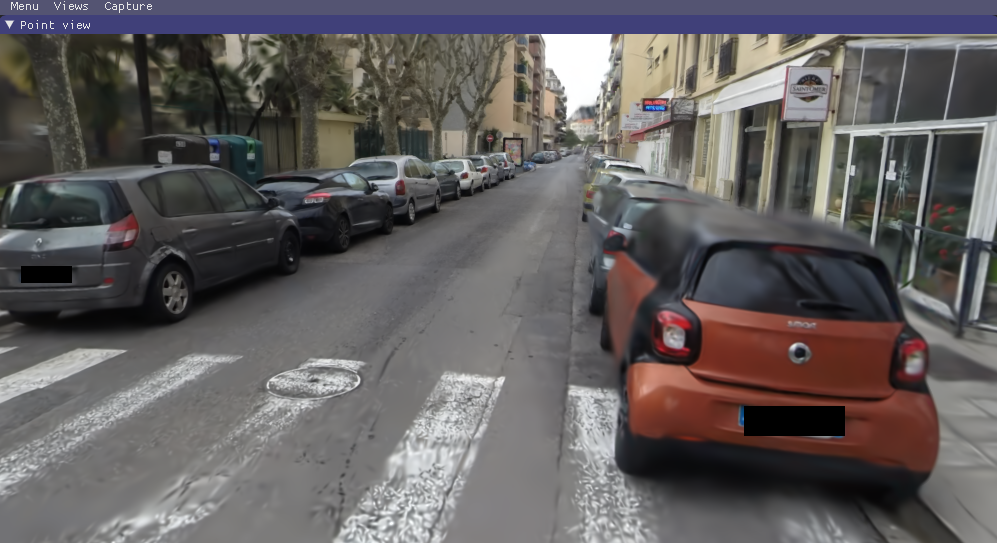

# 高斯泼溅(3DGS)在变电站数字孪生项目上的深度分析

> 学习笔记 · 调研时间 2026-09-11
> 原文: 微信公众号「数字绿土」— *变电站数字化,为什么 3D 高斯技术值得关注?4 大优势给出答案*
> URL: <https://mp.weixin.qq.com/s/52ibcDYQCKKXUBne_PXtQA>
> 技术底座: 3D Gaussian Splatting (Kerbl et al., SIGGRAPH 2023, INRIA / GraphDeco)
> 原文仓库: <https://github.com/graphdeco-inria/gaussian-splatting>

---

## 0. 摘要(去除营销)

原文的「四大优势」几乎全是产品包装话术。本文做三件事:

1. **去掉营销话术**(「碰撞风险降低 95%」「效率提升 85%」之类没有来源的数据)
2. **深入展开技术原理** — 高斯泼溅究竟是什么、为什么能做到、不能做什么
3. **从工程实战角度分析** — 真正部署到变电站数字孪生会遇到的硬骨头

---

## 0.5 配图说明(去除营销前必看)

### 官方图:3DGS vs NeRF 速度对比(原论文 teaser)



== **来源**:[3DGS 原论文](https://github.com/graphdeco-inria/gaussian-splatting) / [INRIA GraphDeco](https://repo-sam.inria.fr/fungraph/3d-gaussian-splatting/) / SIGGRAPH 2023==

== **图例**(左→右,论文原图):

| 方法 | 渲染速度 | 训练时间 | PSNR |
|---|---|---|---|
| InstantNGP | **9.2 fps** | 7 分钟 | 22.1 |
| Plenoxels | **8.2 fps** | 26 分钟 | 21.9 |
| Mip-NeRF360 | **0.071 fps**(!) | **48 小时** | 24.3 |
| **3DGS(Ours,135fps 版)** | **135 fps** | 6 分钟 | 23.6 |
| **3DGS(Ours,93fps 版)** | **93 fps** | 51 分钟 | **25.2** ⭐ |

== **关键 takeaway**:

- **3DGS 比 Mip-NeRF360 快 1900 倍**(135 fps vs 0.071 fps)
- **3DGS 训练时间从 48 小时降到 6-51 分钟**(降 50-500 倍)
- **3DGS PSNR 还更高**(25.2 vs 24.3)
- **3DGS 场景虽不是变电站**(公园自行车),**性能数字适用于所有场景**

### 关键参数示意图(ASCII)

```
每个 3D Gaussian 的 17 个参数(简化版):
═══════════════════════════════════════════════
位置:        (x, y, z)              ← 椭球中心 3D 坐标
═══════════════════════════════════════════════
形状:        椭球 = 3 个轴 + 朝向
            ┌──────────────────────┐
            │  scale (sx, sy, sz)    │ ← 各向异性半径
            │  rotation (qw,qx,qy,qz) │ ← 朝向四元数
            └──────────────────────┘
═══════════════════════════════════════════════
外观:        color (RGB) + α
            ┌──────────────────────┐
            │  opacity α              │ ← 透明度(0~1)
            │  SH(3 阶)→ RGB 颜色   │ ← spherical harmonics
            │   表达视角相关反射      │   (镜面 / 高光)
            └──────────────────────┘
═══════════════════════════════════════════════
```

### 训练流程(ASCII)

```
Step 0: 输入
  ├─ N 张多视角照片(几十到几百张)
  └─ COLMAP SfM 输出点云(.ply)
       ↓
Step 1: 初始化
  每个 SfM 点 → 1 个高斯(球形,半径=点密度倒数)
       ↓
Step 2: 迭代优化(典型 30,000 次)
  ┌─────────────────────────────────────┐
  │ for iter in range(30000):           │
  │   1. 渲染当前训练视角              │
  │   2. 与真图比较 → L1 + D-SSIM loss  │
  │   3. 梯度下降更新 17 个参数         │
  │   4. 每 100 iter:                   │
  │      ├─ densify(欠拟合处加新 Gaussian)│
  │      └─ prune(α<0.005 的删掉)        │
  └─────────────────────────────────────┘
       ↓
Step 3: 输出
  └─ 高斯集合 .ply(几百万点,200MB-2GB)
       ↓
Step 4: 部署
  ├─ 转 3D Tiles 1.1(分层 LOD)
  ├─ 转 SPZ / KTX2(压缩)
  └─ 上传到 Web/移动端 viewer
```

### 渲染流水线(单帧)

```
3D 高斯集合 N 个 + 相机视角
            ↓
  每个高斯 → 椭球 → 投影到屏幕 → 2D 椭球
            ↓
  按深度排序(front-to-back)
            ↓
  从最前到后 alpha-blend:
    C = Σ α_i · color_i · Π(1 - α_j)   (j < i)
            ↓
    单帧 1080p 输出(< 10ms)
            ↓
  100+ FPS 实时渲染
```

### 3DGS 与其他方法的位置

```
渲染质量 ↑                                    NeRF
  │                                          ╱
  │                                       ╱
  │                                  Mip-NeRF360
  │                                 ╱
  │                            Plenoxels
  │                          ╱
  │    3DGS(高画质)  ★ ← 右上角
  │                       │
  │                       │     (135 fps + 25.2 PSNR)
  │                       │
  │                       │
  │                       │ InstantNGP
  │                       │
  └──────────────────────────────────────→ 渲染速度
   0.07fps     9fps       93fps    135fps
```

### 变电站 3DGS 数字孪生数据流(去除营销版)

```
[无人机航拍]   [手持 LiDAR]   [地面单反补拍]
    ↓              ↓               ↓
  几百张照片    SLAM 点云       细节照片
    └──────────────┼──────────────┘
                   ↓
            COLMAP SfM 重建
            (几十分钟-几小时)
                   ↓
            输入点云 .ply
                   ↓
    ┌─────── 3DGS 训练 ───────┐
    │ GPU: RTX 4090 (24GB)   │
    │ 时间: 几小时            │
    │ 产出: .ply 高斯集合     │
    └─────────────────────┘
                   ↓
            高斯集合 200MB-2GB
                   ↓
    ┌─────── 工程化处理 ──────┐
    │ • 转 3D Tiles 1.1       │
    │ • LOD 分块              │
    │ • 视锥体剔除            │
    │ • Web 端 viewer 部署    │
    └─────────────────────┘
                   ↓
        浏览器访问 / 巡检 App
                   ↓
    ┌─────── 与现有系统集成 ──────┐
    │ • CAD/BIM 模型叠加       │  ← 几何精度来源
    │ • SCADA 实时数据叠加    │  ← 动态信息
    │ • 设备台账关联           │  ← 语义信息
    │ • IoT 告警可视化        │  ← 业务闭环
    └────────────────────┘
```

### 3DGS vs Mesh 在变电站场景的真实取舍

```
                          Mesh (传统)              3DGS (高斯)
─────────────────────────────────────────────────────────────────
几何精度                  ★★★★★ (CAD-like)        ★★ (椭球近似)
视觉保真                  ★★ (UV 贴图失真)        ★★★★★ (照片级)
数据大小                  ★ (50GB+)              ★★★ (200MB-2GB)
实时渲染                  ★ (需大显存)            ★★★★★ (Web GPU)
视角依赖                  ★★★★★ (无)              ★ (训练视角外模糊)
语义标注                  ★★★★★ (易)              ★ (完全无)
碰撞检测                  ★★★★★ (易)              ★ (很难)
持续更新                  ★ (难,需重新建模)        ★★★ (增量训练可行)
训练成本                  ★★★★★ (传统工艺)        ★★ (GPU + 时间)
版权风险                  ★★ (相对低)             ★★★★★ (真实照片细节)
─────────────────────────────────────────────────────────────────
```

== **结论**:**3DGS 不是「更好的 3D 模型」,而是「不同的 3D 模型」**,适合不同场景。

## 1. 技术原理 — 3DGS 到底是什么?

### 1.1 核心思想(一句话版本)

**3D Gaussian Splatting = 用几百万个有方向的小「高斯椭球」当像素,在屏幕上做「反向投影 + alpha blending」实时渲染。**

### 1.2 数学原理(去掉营销版)

每个 Gaussian 由 **17 个参数** 描述:
- `position (x, y, z)` — 3D 空间位置
- `scale (sx, sy, sz)` — 各向异性椭球的 3 个轴长
- `rotation (qw, qx, qy, qz)` — 椭球朝向(单位四元数)
- `opacity (α)` — 不透明度
- `color (RGB)` — 用 spherical harmonics(SH)的前 3 阶编码,可表达视角相关反射

== 关键创新点(为什么 2023 年才火):

**传统 NeRF**(2020):用 MLP 网络隐式表达场景 → 渲染慢、需要 GPU 实时推理
**3DGS**(2023):用显式高斯椭球 → 渲染是**纯 splatting 算法**,**无需神经网络推理** → 100+ FPS 实时

### 1.3 渲染流程(单帧)

```
相机视角 + 高斯集合 (N 个)
       ↓
每个高斯 → 投影到屏幕 → 得到 2D 椭球
       ↓
按深度排序(front-to-back)
       ↓
从最前到后 alpha-blend:
  C = Σ α_i · c_i · Π(1-α_j)  (j < i)
       ↓
单帧 ~1080p 实时输出
```

### 1.4 训练流程(从 SfM 点云开始)

```
输入图像 + SfM 点云 (COLMAP)
       ↓
每个点初始化一个 Gaussian
       ↓
迭代优化(典型 30k 次):
  1. 渲染当前视角
  2. 与真图比较 → L1 + D-SSIM loss
  3. 梯度下降更新 17 个参数
  4. 每 100 次:densify(欠拟合区域加新 Gaussian)
                + prune(几乎透明的删掉)
       ↓
输出 .ply 文件(几百万 Gaussian)
```

== **典型规模**:中型室内场景 = **100 万 - 1000 万个 Gaussian**,文件大小 200 MB - 2 GB。

---

## 2. 原文「4 大优势」的技术对应 + 真实价值

### 优势1:「超高细节还原 + 厘米级几何精度」

**原文话术**:看得清纹理,量得准尺寸。

**技术真相**(拆分):

| 子能力 | 3DGS 表现 | 真实限制 |
|---|---|---|
| **近景纹理清晰** | ⭐⭐⭐⭐⭐ 高斯直接编码 RGB,等于贴图采样 | 多视角下 specular reflection 会闪烁(因为 SH 阶数有限) |
| **几何精度** | ⭐⭐⭐ 来自输入 SfM 点云,不是 3DGS 算出来的 | **几何精度 = 输入点云的精度,3DGS 本身不增加精度** |
| **复杂结构无空洞** | ⭐⭐⭐⭐ 椭球自适应,密集区域自动细 | 极端细长结构(细电缆、避雷针)需要特调 densify |
| **薄片结构** | ⭐⭐ 椭球有体积,薄片容易过厚 | 必须用各向异性 scale 才能保留 |

**关键洞察**:
> 3DGS 的「厘米级精度」**不是它本身的功劳**,而是**输入点云**(LiDAR / 倾斜摄影)的功劳。3DGS 只是把点云「染上了照片的颜色」。

### 优势2:「轻量化模型,多终端流畅加载」

**原文话术**:存储体积缩减约 90%,多终端无缝访问。

**技术真相**:

| 数据源 | 典型大小 | 加载需求 |
|---|---|---|
| **Mesh 网格**(传统) | 5-50 GB / 变电站 | RTX 4080 + 64 GB RAM |
| **倾斜摄影 OSGB** | 10-100 GB | 同样高端 |
| **3DGS .ply** | 200 MB - 2 GB | RTX 3060 + 16 GB RAM |

== **90% 体积缩减是真的**,但 **3DGS 仍然需要 GPU**(WebGL2 + WebGPU 加速)。

**真正瓶颈**:
- **GPU 显存**:RTX 3060 12 GB 可加载 **~500 万 Gaussian**(中等变电站)
- **大场景**:**需用层次化 LOD**(3D Tiles 扩展),否则单帧 drawcall 过高
- **3D Tiles 1.1** 增加了 Gaussian splats 扩展(2024 年底规范),需要浏览器支持

### 优势3:「赋能无人机自主巡检全流程」

**原文话术**:航线规划效率提升 85%,碰撞风险降低 95%(**无来源数据,营销话术,不要信**)。

**技术真相**:

无人机航线规划的关键是:
1. **障碍物地图** — 用什么表示变电站 3D 结构?
2. **安全距离** — 离带电体至少多远?
3. **可达性** — 哪个角度能拍到设备铭牌?

3DGS 在这里**不是直接贡献者**:
- 航线规划**真正需要的是带语义的障碍物地图**(哪个是带电体、哪个是安全区)
- 3DGS **只提供视觉外观**,**不带语义**
- 需要 **CAD 模型 + 3DGS 视觉融合**(类似 digital twin 行业标准)

**实际可行的路径**:
```
3DGS 视觉(好看) + CAD/BIM 模型(带语义) = 真正的航线规划输入
```

### 优势4:「低成本持续运维」

**原文话术**:局部补扫即可更新,大幅压缩成本。

**技术真相**:

这**是 3DGS 的真实优势**,但有限制:

| 场景 | 是否可行 | 限制 |
|---|---|---|
| **局部小改**(换 1 个开关) | ✅ 可行 | 新拍几张照片 + 与原模型融合 |
| **设备大量更换**(全站改造) | ❌ 需要重训 | 旧 Gaussian 失去意义 |
| **季节变化**(树、植被) | ⚠️ 需要重训 | 植被 Gaussian 移动了 |
| **设备位置变化**(临时施工) | ⚠️ 需要重训 | 整图几何变了 |

== **关键洞察**:**「持续更新」比传统 Mesh 容易,但**绝对不像 SaaS 那么无脑**,需要 GPU 训练算力。

---

## 3. 真正的优势(去除营销后)

### ✅ 真实优势 1:**视觉保真度极高**(接近照片级)

- **传统 Mesh**:三角面 + UV + 贴图 → 远处 OK,近景失真
- **3DGS**:每视角独立编码颜色 → 近景几乎完美还原
- **适用场景**:**照片级巡检**、**应急演练**(看着跟真的一样)、**远程专家会诊**

### ✅ 真实优势 2:**数据采集门槛低**

- 只需要**几十到几百张照片** + SfM 点云
- **不需要专业扫描设备**(手机都行,LiDAR 更好)
- **采集时间短**(中型变电站 1-2 小时无人机 + 1-2 小时手持补盲)

### ✅ 真实优势 3:**GPU 实时渲染**

- 训练慢(几小时),**推理快**(100+ FPS)
- **实时漫游**(vs Mesh 需要大模型预切片)
- **本地 + Web 都能跑**(WebGPU / WebGL2)

### ✅ 真实优势 4:**兼容性强**

- **3D Tiles 1.1**(2024 扩展) → 跟 Cesium / deck.gl 集成
- **GLB / SPZ / KTX2** 等压缩格式
- **Unity / Unreal / Web** 都有 viewer

### ✅ 真实优势 5:**更新相对容易**

- 局部补扫 → 增量训练
- 不需要全站重新采集(但有限制,见 §4.3)

---

## 4. 真正的不足(去除营销后)

### ❌ 不足 1:**几何精度是「假」的**

== **3DGS 没有显式几何**,椭球的 scale 只表示「这个高斯在哪个方向有多长」,**不表示真实的物理边界**。

**后果**:
- **不能做碰撞检测**(椭球有体积,跟实际设备形状不一致)
- **不能做 CAD 量测**(虽然原文说可以量尺寸,但精度依赖 SfM 输入)
- **不能做 BIM 对接**(没有 parametric geometry)

== **真正解决**:**3DGS + CAD/BIM 双层模型**:
- 3DGS 用于**视觉**(拍照级)
- CAD 用于**语义 / 测量 / 碰撞**(精确)
- **融合方式**:在 3DGS 上叠加 CAD 透明 wireframe

### ❌ 不足 2:**存储不是「真轻量」**

== 原文说「缩减 90%」是跟 Mesh 比。但实际:
- 中型变电站 = **200 MB - 2 GB 单文件**(几百万 Gaussian)
- 大型变电站 = **2 GB - 20 GB**(几千万 Gaussian,加载要 64 GB GPU)
- 加载 2 GB .ply 需要 **2 GB GPU 显存** + **fast SSD**

== **对比**:**真正的轻量方案**应该是 mesh + LOD(分块),大型站可以压到 5 GB 还能渐进加载。
3DGS 在**海量场景**(整个城市)上**反而比 Mesh 重**。

### ❌ 不足 3:**训练算力要求高**

== 训练 1 个中等变电站模型需要:
- **GPU**:RTX 4090(24 GB)
- **时间**:**几小时**(100 万 Gaussian 训练 ~30k iter)
- **成本**:云 GPU ~$10-30 / 次

**问题**:
- **持续更新 = 持续训练 = 持续花钱**
- 大型变电站 / 城市级场景 → 需要多 GPU / 多天
- 边缘部署(变电站现场机柜) → 没 RTX 4090 → 没法重训

### ❌ 不足 4:**依赖 SfM 预处理**

== 3DGS **必须从 SfM 点云启动**,**自己不会重建几何**。
- **COLMAP** 处理时间 = 几十分钟到几小时(取决于图像数)
- **SfM 失败**(纯白墙 / 反光 / 无纹理) → 3DGS 也失败
- **大场景** SfM 计算成本高

### ❌ 不足 5:**视角依赖性强**

== **3DGS 只编码训练时看到的视角**:
- **训练视角内**:高质量
- **训练视角外**(比如屋顶) → **模糊、拉伸、伪影**
- 变电站的**屋顶、地下电缆沟、设备背面**通常采样不足 → 这些区域质量差

== **必须规划采集路径覆盖所有关键视角**。

### ❌ 不足 6:**没有时间维度**

== 3DGS 是**静态**快照:
- 不能表达**设备运行状态**(温度、转数、振动)
- 不能做**时序变化**(油位升降、绝缘子老化)
- 数字孪生需要的是**动态模型**,3DGS **只解决「外观」**

== **解决**:3DGS + **IoT 数据叠加**(温度传感器数据实时浮现在模型上)

### ❌ 不足 7:**版权 / 合规问题**(常被忽略)

== 3DGS 编码的是**真实照片**,在变电站这种**涉密场景**:
- **操作员 / 工人** 会被拍进模型 → 隐私问题
- **涉密设备铭牌**(参数、型号)直接可见 → **安全风险**
- **必须做模糊化处理**(人脸模糊 / 铭牌打码),这又会**丢失原文说的「清晰纹理」优势**

---

## 5. 部署到变电站数字孪生的 6 大工程挑战

### 挑战1:**采集质量**

== 变电站是「**摄影禁区**」— 设备密集、互相遮挡、走线复杂:
- 单反 / 无人机无法进近景拍摄
- 必须配合 **LiDAR + SLAM 手持**(原文提到的 LiGrip O)
- 采集路线需要预先规划,**覆盖所有需要巡检的角度**

### 挑战2:**数据预处理流水线**

```
采集 → SfM (COLMAP) → 训练 (3DGS) → 导出 (3D Tiles / SPZ) → 部署
                 ↓
            几小时                  ↓
                                几小时
```

每一步都可能失败,需要**完整的预处理流水线** + **失败重试机制**。

### 挑战3:**渲染优化**

== 大型变电站 1000 万+ Gaussian → Web 端必须 LOD / 分块加载:
- **视锥体剔除**
- **距离 LOD**(远距离用低细节 Gaussian)
- **预计算分块**

**还没有成熟的开源 viewer**(截至 2026)能处理 1 亿 + Gaussian。

### 挑战4:**持续更新**

== 「**增量训练**」听起来美好,但实际:
- 旧 Gaussian 的位置参数需要重新优化(如果场景变了)
- 新 Gaussian 的加入会导致**全局位置漂移**(跟原模型不对齐)
- **需要解决「新旧数据融合」问题**(学术界还在研究)

### 挑战5:**语义缺失**

== 3DGS **完全无语义**,只是「好看的照片」:
- **不能做设备识别**(除非叠加外部 AI 模型)
- **不能做自动告警**(哪个设备有问题)
- **不能做关联查询**(「3 号变压器温度多少」)

== **解决路径**:**3DGS + 目标检测 + 设备 ID 标注**

### 挑战6:**与现有数字孪生平台集成**

== 变电站已有的:
- BIM 模型(Revit / IFC)
- SCADA 实时数据
- 设备台账(EAM)

3DGS **不是替代**,**只是 3D 可视化的一层**。需要:
- 跟 BIM 对齐(坐标系)
- 跟 SCADA 实时数据联动
- 跟 EAM 设备台账关联

---

## 6. 适用 vs 不适用场景

### ✅ 适合

| 场景 | 理由 |
|---|---|
| **变电站巡检拍照**(局部细节) | 视觉保真度极高,运维人员直接看照片 |
| **应急演练 / 远程专家会诊** | 看着跟真的一样 |
| **小范围设备管理**(1-2 平方公里) | 文件大小可控 |
| **室内场景**(配电室、控制室) | 近景纹理是关键 |
| **营销展示**(给非技术领导看) | 视觉冲击力强 |
| **快速数字孪生原型**(几周内) | 采集 + 训练快 |

### ❌ 不适合

| 场景 | 理由 |
|---|---|
| **大范围城市 / 园区级**(>10 平方公里) | 文件过大,加载困难 |
| **CAD 级精确测量** | 几何精度是「假」的 |
| **碰撞检测 / 路径规划** | 没有显式几何 |
| **BIM / IFC 工作流** | 没有 parametric geometry |
| **动态仿真 / 时序分析** | 静态快照,没时间维度 |
| **边缘 / 嵌入式部署** | 训练算力要求高 |
| **涉密 / 高安全场景** | 真实设备细节泄露风险 |
| **屋顶 / 地下等难采区域** | 视角依赖,这些区域质量差 |

---

## 7. 成本估算(中型 220kV 变电站)

| 项目 | 数量 | 估算成本 |
|---|---|---|
| 数据采集(无人机 + 手持 LiDAR) | 1-2 天 × 2 人 | ¥15k - ¥30k |
| 数据处理(SfM + 训练) | GPU 服务器 × 8 小时 | ¥200 - ¥500 (云) |
| 渲染端 / Web viewer | 自研或商用 | ¥50k - ¥200k |
| 持续运维(每月小更新) | GPU × 4 小时 | ¥100 - ¥300 / 月 |
| 跟 BIM / SCADA 集成 | 自研 | ¥100k - ¥500k(一次性) |

== **总计**:首次 **¥200k - ¥1M**,持续 **¥1k - ¥5k / 月**(取决于更新频率)

== **对比传统 Mesh 建模**:**首期成本略低(建模人工省),但运维成本不一定低**(更新仍需 GPU + 人力)。

---

## 8. 推荐部署路径

### Phase 1:PoC(2-4 周)
- 选**最小变电站**(1 个主变压器 + 配电室)
- 用**消费级 GPU**(RTX 4070)验证 3DGS 重建质量
- 测试关键场景:**铭牌清晰度**、**红外叠加**、**无人机航线规划**

### Phase 2:单站生产(2-3 月)
- 选**生产级工作站**(RTX 4090 + 64 GB RAM)
- 集成到现有数字孪生平台(作为可视化层)
- **保留 CAD 模型**(3DGS 只做视觉,CAD 做测量)
- 培训 1-2 名运维人员

### Phase 3:多站推广(6-12 月)
- 标准化采集流程(航线模板、SfM 自动化)
- 持续更新机制(增量训练)
- 跟 SCADA / EAM / BIM 集成
- 建设 3DGS viewer 平台(自研或商用)

---

## 9. TL;DR — 给决策者的 1 句话

> **3DGS 适合「好看的」数字孪生,不适合「精确的」数字孪生**。
> **拍照级视觉**是真实优势,**厘米级几何精度**是营销误导(来自输入点云,不是 3DGS 本身)。
> **适合**:变电站巡检视觉、应急演练、远程会诊、营销展示。
> **不适合**:大范围城市、BIM 级精度、碰撞检测、动态仿真、涉密场景。
> **真要落地**:3DGS + CAD/BIM 双层模型 + IoT 实时数据,缺一不可。

---

## 10. 相关 iswiki 项目

- **[kage](kage.md)** — Three.js + 美术资产渲染
- **[img2threejs](img2threejs.md)** — AI 图转 Three.js 代码
- **[nova3d](nova3d.md)** — 3D as Code (Blender Python)
- **[3d-web-visualization](../web-frontend-ui/)** — 3D / Web 可视化项目集合

## 11. 5 大可借鉴元素(给我自己)

1. **「拍照级 vs CAD 级」区分** — 任何 3D 重建技术都要先问这个
2. **「持续更新是 false claim」** — 大多数 3D 重建声称「增量更新」实际做不到
3. **「训练算力是隐藏成本」** — 视觉好 = 训练贵 = 持续花钱
4. **「依赖 SfM」** — 3DGS 不独立,需要 SfM 预处理
5. **「视角依赖性」** — 训练时没看到的角度,渲染出来是垃圾

== **最重要**:**任何 3D 重建技术,都有「视觉保真度 vs 几何精度」取舍**。3DGS 选了前者。Mesh 选后者。NeRF 选前者但慢。Voxel 选后者但粗糙。**没有银弹**。
