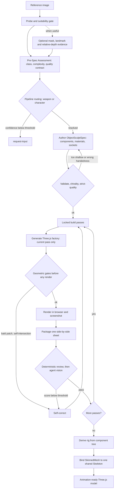

# img2threejs — AI 图转可编辑 Three.js 代码(15K ⭐)

> 学习笔记 · 调研时间 2026-09-01
> 来源: 微信公众号「三木前端笔记」— *给 AI 一张图,它能生成可动画的 Three.js 模型*
> GitHub: <https://github.com/img2threejs/img2threejs>
> 在线 Demo: <https://img2threejs.github.io/img2threejs-showcase/>
> 架构文档: <https://github.com/img2threejs/img2threejs/blob/main/docs/ARCHITECTURE.md>

---

## 1. 一句话定位

**img2threejs = "AI 看图,写 Three.js 代码(不是生成网格)"** — 给 Claude Code / Codex / OpenCode 用的 skill,**图片转 3D 不是 photogrammetry**,而是 **AI 按 8 阶段写 TypeScript 代码**,**保留组件层级/材质/枢轴/插槽/碰撞体**,产物是 **可继续编辑的 Three.js 代码**,**不是 .glb/.fbx 网格文件**。

## 2. 核心数据

| 字段 | 值 |
|---|---|
| **GitHub stars** | **15,039** ⭐ (1.5 个月!) |
| **Forks** | 1,223 |
| **License** | **Apache-2.0** |
| **Size** | 35.5 MB / 357 文件 |
| **Language** | Python (主, stdlib only) + TypeScript (生成的输出) |
| **Created** | 2026-07-15 |
| **Updated** | 2026-09-03 (active,2 天前 commit) |
| **Version** | 1.5.2 |
| **Topics** | `3d, ai-agents, claude-code, computer-graphics, generative, image-to-3d, procedural-generation, threejs, typescript, webgl` |
| **Sponsors** | Atlas Cloud / Tripo / Hyper3D |

## 3. 跟"传统图片转3D"的本质区别

| 维度 | 传统 photogrammetry / mesh extraction | **img2threejs** |
|---|---|---|
| **产物** | .glb / .fbx / .obj 网格文件 | **TypeScript Three.js 代码** |
| **可编辑性** | ❌ 二进制不透明 | ✅ Git 追踪,逐组件修改 |
| **组件结构** | ❌ 一整块不能拆 | ✅ 命名部件 / 插槽 / 碰撞体 |
| **动画准备** | 需要重新绑定骨骼 | ✅ 派生 rig + SkinnedMesh + Skeleton |
| **token 消耗** | (N/A) | **deliberately token-efficient**(每阶段) |
| **质量门** | 一次性生成 | ✅ **8 阶段 + 视觉复核循环** |
| **失败处理** | 直接重试 | ✅ 失败→ 回规格阶段 → 修规格,不是推倒重来 |

== **核心哲学**:**重建by code,不是 extract mesh**

## 4. 核心架构 — 3 阶段流水线

```
┌──────────────────────────────────────────────────────────────────┐
│ Phase 1: Intake(确认输入)                                       │
│  Reference Image → Python 校验脚本(forge/stage1_intake/)    │
│  - 检查图片是否适合 3D 重建                                       │
│  - 记录 pass / conditional / reject 评估                          │
│  - 置信度 < 0.82 → request-input(向用户澄清)              │
└──────────────────┬───────────────────────────────────────────────┘
                   │
                   ↓
┌──────────────────────────────────────────────────────────────────┐
│ Phase 2: ObjectSculptSpec(施工图)                              │
│  AI 分析图片 → 写 ObjectSculptSpec JSON                          │
│  - 组件层级 + 材质 + 灯光 + 枢轴 + 插槽 + 动作锚点              │
│  - 通过 strict-quality 校验                                     │
│  - 通过 chirality(左右手性)校验                              │
└──────────────────┬───────────────────────────────────────────────┘
                   │
                   ↓
┌──────────────────────────────────────────────────────────────────┐
│ Phase 3: 8-Stage Build Pipeline(8 阶段构建)                 │
│  blockout → structural → form → material                       │
│  → surface → lighting → interaction → optimization              │
│                                                                  │
│  每阶段:                                                          │
│  1. 生成当前阶段代码                                              │
│  2. 几何门(运行前): bald patch / self-intersection           │
│  3. 浏览器渲染 + screenshot                                      │
│  4. Python 确定性复核                                             │
│  5. AI vision 判断(通过/失败)                              │
│  6. 失败 → 自校正 → 重做当前阶段                                │
│  7. 3 corrections per pass 上限                                  │
└──────────────────┬───────────────────────────────────────────────┘
                   │
                   ↓
┌──────────────────────────────────────────────────────────────────┐
│ Final: Animation-Ready Model                                    │
│  派生 rig → 绑定 SkinnedMesh + Skeleton → 可直接加动画           │
└──────────────────────────────────────────────────────────────────┘
```

## 5. ARCHITECTURE.md 完整流水线(Mermaid)



## 6. 8 阶段构建详解

```
Stage 1: blockout              → 整体轮廓 / 比例 / 占位几何
Stage 2: structural-pass       → 组件层级 / 子组件 / 连接关系
Stage 3: form-refinement       → 详细几何 / 圆角 / 边缘 / 表面起伏
Stage 4: material-pass         → 材质 / PBR maps / 颜色空间
Stage 5: surface-pass          → 表面细节 / 纹理 / 凹凸
Stage 6: lighting-pass         → 灯光 / 阴影 / IBL
Stage 7: interaction-pass      → 插槽 / 碰撞体 / 事件钩子
Stage 8: optimization-pass     → LOD / 性能 / 减面
```

### 6.1 每阶段执行契约

```
1. AI 生成当前阶段代码(只生成当前,不预生成下一阶段)
2. 几何门(forge/ 下 Python 脚本)
   - bald patch(破洞) → 标记 +回滚
   - self-intersection(自交) → 标记 +回滚
3. 浏览器渲染 + screenshot
4. 打包 side-by-side 对比图(参考图 + 渲染图)
5. Python 确定性复核(像素对比 / 特征对比)
6. AI vision 评分(参考图 vs 渲染图)
   - score < threshold → 自校正 → 重做
   - score ≥ threshold → 进入下一阶段
7. 3 corrections per pass 上限(防止无限循环)
```

### 6.2 不变式

- == **几何门必须在 render 之前** — 几何错了不浪费 render 资源
- == **每阶段独立评估** — 不能"全局分数还行就过了"
- == **失败回规格阶段** — 不是回上一阶段,而是回规格(spec 的错误)

## 7. ObjectSculptSpec(规格 schema)

== 关键概念:**spec 先于 code** — AI 不能直接写代码,必须先写 spec,然后 spec 通过校验才能写代码。

```json
{
  "components": [
    {
      "id": "head",
      "type": "box|sphere|cylinder|primitive|compound",
      "position": [x, y, z],
      "rotation": [x, y, z],
      "children": ["eye_left", "eye_right", "mouth"]
    }
  ],
  "materials": {
    "skin": {
      "type": "PBR",
      "color": "#FFD700",
      "roughness": 0.5,
      "metalness": 0.0
    }
  },
  "lighting": {
    "ambient": "#404040",
    "key_light": {
      "type": "directional",
      "position": [5, 5, 5],
      "intensity": 1.0
    }
  },
  "pivots": [...],
  "sockets": [...],        // 插槽(动画挂载点)
  "action_anchors": [...], // 动作锚点
  "materialPipeline": {     // 材质参考(可选)
    "regions": [
      {
        "name": "skin",
        "verified_crop": "path/to/crop.png",
        "reference_maps": ["albedo", "normal", "roughness"]
      }
    ]
  }
}
```

## 8. Token Efficiency — 为什么 token 友好

| 机制 | 作用 |
|---|---|
| **8 阶段拆分** | 每阶段只生成当前代码,不是全模型一次性 |
| **几何门在前** | 不浪费 token 在明显错的 render 上 |
| **Python 脚本做确定性检查** | AI 不需要重复读 + 统计信息 |
| **AI 只做判断** | 视觉判断 + 决策,不读重复数据 |
| **.img2threejs/state.json** | 持久化进度,不靠 chat memory |
| **forge/next.py 报告当前步骤** | AI 知道下一步做什么,不查 README |

== **核心**:**Python + 确定性脚本负责 80% 的工作**(数据计算 / 渲染 / 对比 / 状态),**AI 只负责 20%**(视觉判断 + spec 写作)

## 9. 强制视觉门(Mandatory Visual Screenshot Gate)

CLAUDE.md 强调的硬门:

```
1. Verify browser/screenshot tooling is installed, authenticated, reachable
2. Save fresh PNG/JPEG screenshots inside the workspace
3. Read back screenshots with image-capable tool
4. Produce side-by-side reference/render comparison
5. If capture fails → STOP and repair tooling first
```

== **核心**:**inline previews alone are not evidence** — 必须有可读 PNG/JPEG 才算视觉验证通过。

## 10. 目录结构

```
img2threejs/
├── SKILL.md                    # 31 KB,always-loaded router
├── README.md                   # 39 KB
├── CLAUDE.md                   # 2.8 KB,shared project instructions
├── CHANGELOG.md                # 33 KB
├── ROADMAP.md                  # 16 KB
├── LAB-FINDINGS.md             # 5.8 KB
├── plugin.json / steps.json    # 客户端集成
├── forge/                      # ⭐ 确定性 Python 工具
│   ├── next.py                 # 主入口:报告下一步
│   ├── state.py                # 状态管理(.img2threejs/state.json)
│   ├── stage1_intake/          # 准入门
│   ├── stage2_spec/            # spec 校验
│   ├── materials/              # 材质参考 registry
│   ├── tests/                  # unit tests
├── grimoire/                   # 路由参考材料(intake / spec / passes / tools)
├── scripts/                    # 辅助脚本
├── docs/                       # ARCHITECTURE.md + 其他
├── integrations/               # Claude Code / Codex / OpenCode 适配
├── skills/                     # 给其他客户端的 skill bundle
├── assets/                     # logo + reference 图
└── .github/                    # CI
```

## 11. 客户端集成 — Agent-Agnostic

### 11.1 Canonical Shared Checkout

```bash
# Keep ONE checkout, let every host enter through a symlink
~/.claude/skills/img2threejs -> <your checkout>
~/.codex/skills/img2threejs  -> <your checkout>
```

**关键**:**symlink,不是 copy** — 防止 Claude 和 Codex 漂移。

### 11.2 跨客户端支持

支持 Claude Code / Codex / OpenCode。**核心机制**:`agent vision` / `agent browser tool` 替换成 host 提供的:
- native image reading
- browser MCP (playwright / chrome-devtools)
- project preview
- user-supplied screenshot

== **设计哲学**:**SKILL.md 不绑定特定客户端**,**适配在 integrations/ 层**。

## 12. 3 大应用场景(适用边界)

| ✅ 适合 | ❌ 不适合 |
|---|---|
| 产品官网 3D 展示 | 高精度资产(传统建模更优) |
| 可点击拆解的设备结构 | 隐藏区域需要真实几何 |
| 游戏道具原型 | 照片级真实角色重建 |
| 教学演示 | |
| 需要继续绑定动画 + 交互的创意可视化 | |

== **边界明确**:**单张图片看不到背面**,不能保证隐藏区域的几何真实;**风格化重建,不是照片级还原**。

## 13. 3 个 Live Demo 案例(文章里给的)

| 案例 | 类别 | Demo 链接 |
|---|---|---|
| **Pikachu 10K Star Celebration** | 角色 | img2threejs.github.io/img2threejs-showcase/ |
| **Sony WF-1000XM3 Earbuds + Case** | 产品(硬表面)+ 动画 | 同上 |
| **Doraemon House** | 场景(等距) | 同上 |

== 共同点:**每个 case 都有可旋转 view + 参考图 + 生成源码**(3 tabs)。

## 14. 5 大核心设计哲学

1. **"Reconstruction by code, not mesh extraction"**
   - 产物是代码,不是二进制网格 → 可编辑 / 可 Git / 可修改

2. **"Spec before code"**
   - AI 不能直接写代码,先写 ObjectSculptSpec → spec 通过校验 → 才能写代码

3. **"Token-efficient by design"**
   - Python 确定性脚本做 80% 工作,AI 只做 20% 视觉判断
   - 8 阶段拆分,每阶段 token 量可控

4. **"Fail at the right layer"**
   - 几何门在 render 前(不浪费 render)
   - 失败回规格(spec 错了,不是 code 错了)

5. **"Visual evidence is mandatory, not inline preview"**
   - 必须有可读 PNG/JPEG 文件,不是聊天里的 inline image

## 15. 跟我已有项目的可借鉴性

### 15.1 跟 substation-blueprint 对比

| 维度 | substation-blueprint | **img2threejs** |
|---|---|---|
| **产物** | single HTML + Three.js 代码 | **TypeScript Three.js 代码** |
| **生成方式** | 人工手写 + OPC CEO | **AI 从图片自动生成** |
| **Skill 系统** | 无 | ✅ **3 大 phase**(intake / spec / build) |
| **质量门** | CI (lint / push) | ✅ **几何门 + 视觉门 + 8 阶段门** |
| **Token efficiency** | (N/A) | ✅ **Python 80% + AI 20%** |

### 15.2 跟 OpenOPC + reverse-skill 对比

| 维度 | img2threejs | reverse-skill | **OpenOPC** |
|---|---|---|---|
| **目标** | 图片转 3D 代码 | 安全任务路由 | 多 Agent 协作 |
| **核心范式** | 8 阶段 + 视觉门 | R0-R39 路由 + scope | CEO + workers |
| **SSoT** | `.img2threejs/state.json` | `routing.json` / `RULES.md` | ❌ 无明确 SSoT |
| **Token efficiency** | ✅ **Python 80% + AI 20%** | ✅ ops 契约 + scope 硬门 | ❌ 全部靠 LLM |

### 15.3 5 大可借鉴元素

1. **"Spec before code" + 校验门**
   - 写代码前先写 spec,spec 通过才能写代码
   - 应用:OpenOPC 可以加 spec 校验门
2. **"Visual evidence is mandatory"**
   - 不接受 inline preview,必须有文件级证据
   - 应用:substation-blueprint 视觉验证应该更严格
3. **Python 确定性脚本 + AI 判断分工**
   - 减少 AI 重复劳动
   - 应用:hermes-agent 应该有更多 Python 助手
4. **8 阶段拆分 + 每阶段独立门**
   - 不是一次性生成,逐步增量
   - 应用:OpenOPC task 应该分阶段,每阶段有验收门
5. **.img2threejs/state.json 持久化进度**
   - 不靠 chat memory,文件状态机
   - 应用:OpenOPC 任务状态应该持久化到 DB

### 15.4 关键借鉴 — **可应用到 substation-blueprint**

substation-blueprint 是「手动写3 + Three.js 代码」,**生成产物本来就是 TypeScript / 类**。

如果 substation-blueprint 要加 **AI 自动从图片生成** 功能:
1. **3 phase 拆分**:intake(screenshot) → spec(component layout) → build(8 阶段)
2. **视觉门**:每次 build 后必须 screenshot 验证
3. **state.json 持久化**:不靠 chat memory,跨 session 续传

## 16. 适用 substation-blueprint 的具体建议

1. **加 image-to-blueprint 模式**: 用户给 substation 设计图 → AI 生成 Three.js 代码
2. **复用 8 阶段**: blockout → structural → form → material → surface → lighting → interaction → optimization
3. **加视觉门到 CI**: 不只是 bundle size,还要 screenshot 对比
4. **state.json 持久化**: 跨 session 续传 substation-blueprint 的 build state

## 17. 跟同类项目的对比

| 项目 | 产物 | 类别 |
|---|---|---|
| **img2threejs** | Three.js 代码 | code-only / procedural / quality-gated |
| **Meshy / Tripo / Hyper3D** | .glb 网格 | photogrammetry / mesh extraction |
| **CSM (Common Sense Machines)** | .glb 网格 | generative 3D |
| **Luma Genie** | .glb 网格 | generative 3D |
| **Kiri Engine** | .glb 网格 | photogrammetry |

== **img2threejs 是唯一 code-only 路径** — 其他都是 mesh 文件。

## 18. 相关 iswiki 项目

- **[redart-sk](artemis-redradman.md)** (44 ⭐) — 同 Three.js 范式,数据密度高
- **[kage](kage.md)** (1407 ⭐) — 京都夜行寺,scroll-driven + 手绘 WebP
- **[vgpu](vgpu.md)** (1119 ⭐) — WebGPU library
- **[reverse-skill](reverse-skill.md)** (33.7k ⭐) — 安全任务路由包
- **[img2threejs](img2threejs.md)** (15k ⭐) — 本文:AI 图转 Three.js 代码

## 19. TL;DR

**img2threejs = AI 看图 + 写 Three.js 代码(不是生成网格)**,1.5 个月涨到 15K ⭐,**Apache-2.0**。

==**3 大核心**:
1. **8 阶段构建** + 视觉复核(不是一次性生成)
2. **ObjectSculptSpec 规格**(spec 先于 code)
3. **Token-efficient 架构**(Python 80% + AI 20%)

==**3 大最佳应用**:
- 产品官网 3D 展示
- 可点击拆解的设备结构
- 教学演示 + 创意可视化

==**最值得学的 1 点**:**「Spec before code + Visual evidence mandatory + Python-AI 分工」** — 任何"AI 生成视觉/代码"项目都应该学:
- 先 spec 后 code,spec 通过才能 code
- 视觉/输出必须有文件级证据,不是 inline preview
- Python 确定性脚本做 80%,AI 做 20% 视觉判断
