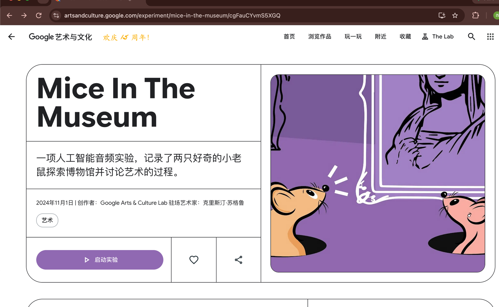
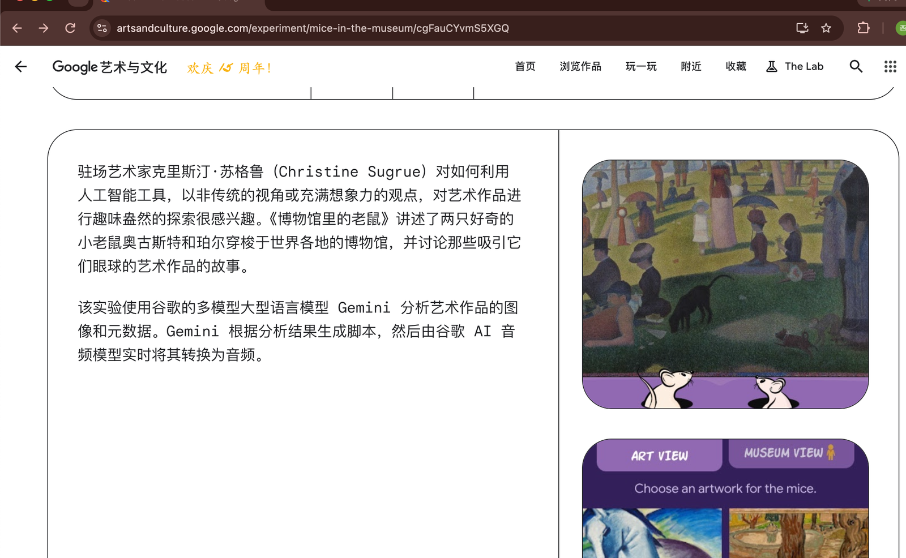
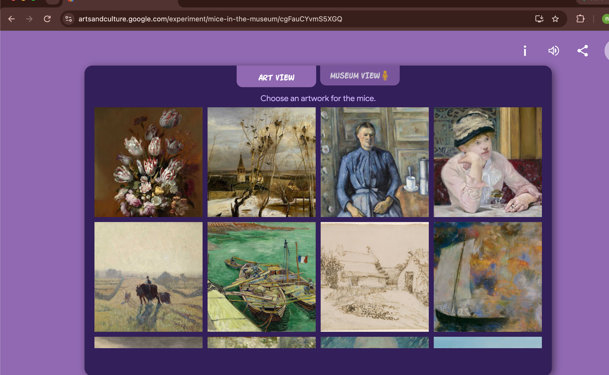
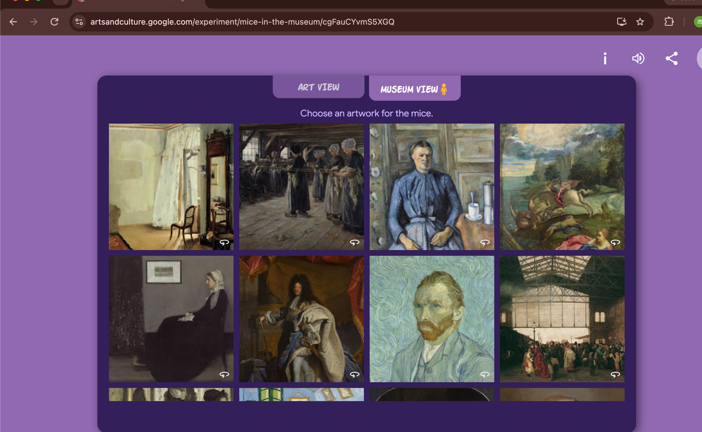
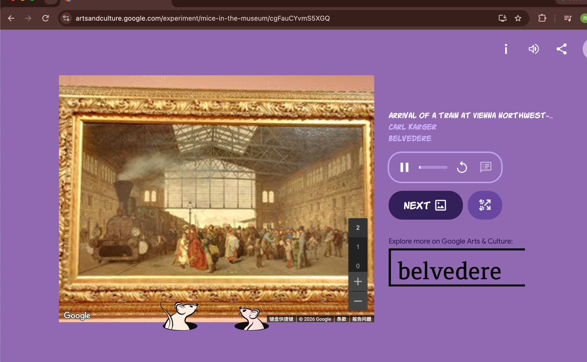

# Mice In The Museum — Google Arts & Culture 的多模态 AI 音频导览实验

> 学习笔记 · 调研时间 2026-09-21
> 实验页: https://artsandculture.google.com/experiment/mice-in-the-museum/cgFauCYvmS5XGQ
> 实验托管: https://gacembed.withgoogle.com/mice-in-museum/
> 创作者: Google Arts & Culture Lab · Artist In Residence Christine Sugrue
> 上线日期: 2024-11-01
> 合作博物馆: 维也纳 Belvedere(主版本 `cgFauCYvmS5XGQ`) / 柏林 Gemäldegalerie(独立 article `JwHp29GHTw0GQQ`) / Musée d'Orsay / Ohara Museum of Art
> 调研方式: 本地 Chrome 实机打开实验页面 + 网络层抓 HTML / JS / CSS bundle + 二次评测交叉验证

## 一句话定位

**Google Arts & Culture 上线的一个 AI 音频实验**:让两只虚拟小鼠 August 和 Pearl 带你游览博物馆作品,**Gemini 多模态实时生成解说脚本 + Google AI Audio 模型实时合成语音**,全程浏览器端播放。官方归类「文化探索 / 玩一玩」,不是艺术史工具。

## 两种打开方式

| 方式 | 入口 | 适用场景 |
|---|---|---|
| **官方壳页(推荐)** | `artsandculture.google.com/experiment/mice-in-the-museum/cgFauCYvmS5XGQ` | 完整 UI + 收藏 / 分享 + 返回导航 |
| **实验本体(直接嵌入)** | `gacembed.withgoogle.com/mice-in-museum/` | 给二次嵌入用,**裸开会被服务端拦截显示 "This experiment is not available on this platform."**(只允许从 artsandculture.google.com 进入) |

⚠️ **别用「列表页 URL」**:`/experiment/mice-in-the-museum/`(末尾带斜杠,无 article id)直接 404,因为它只是个 slug 入口,必须带具体文章 id `cgFauCYvmS5XGQ`(主版本)/ `JwHp29GHTw0GQQ`(柏林 Gemäldegalerie 版)。

## 入口页(壳页)真实样子



> 上图是 2026-09-21 在本地 Chrome 实机打开 `cgFauCYvmS5XGQ` 的入口页截图。注意:
> - **官方中文字幕**: "一项人工智能音频实验,记录了两只好奇的小老鼠探索博物馆并讨论艺术的过程。"
> - **元数据行**: "2024年11月1日 | 创作者:Google Arts & Culture Lab 驻场艺术家:克里斯汀·苏格鲁"
> - **分类标签**: "艺术"
> - **插图**: 两只小鼠抬头看蒙娜丽莎的紫色调插画
> - **顶部 GAC 标志**: "Google 艺术与文化 欢庆 15 周年!"

## 三层技术栈

### L1 客户端(浏览器内)

- **静态托管**: 单一 ES module JS bundle + 一个 CSS bundle(`index.8936ee68.js` ~125 KB minified / `index.be3abf96.css` ~8 KB)
- **服务端**: `Server: Google Frontend`(GFE) — Google 内部 CDN,2026-09 实测 HTML 200 / CSS Age=313s(命中 CDN 缓存)/ JS Age=0(刚发布)
- **音频**: HTML5 `<audio>` + Web Audio API(项目里看到 `<audio controls id="audio">` + `play-svg/pause-svg` 自绘控件)
- **图像/画布**: 图像拼贴做小鼠与场景过渡(`mice-image-1/2` 状态切换),用 `<canvas>` 做合成
- **Google Street View 嵌入**: DOM 里看到 `pano-container` + `gmap-item` class,意味着作品「博物馆视角」会嵌入 Google Street View 全景图
- **可访问性**: `aria-label="Choose artwork"` / `aria-label="random artwork"` / `aria-label="about"` / `aria-label="toggle mute"` 等标准标注

### L2 后端服务(Google 内部)

- **图像理解**: **Gemini**(Google 多模态大模型)— 多模态输入包括 `text & image`、`text & audio`
- **脚本生成**: Gemini 根据作品元数据(metadata)+ 视觉元素生成对话脚本
- **实时语音合成**: **Google AI Audio model**(基于 Gemini 的原生 TTS / Audio 输出能力)把脚本实时转音频,流式返回浏览器

官方原文("How it works",见下方截图):

> 1. **Understanding the Artwork** — To understand the artwork, we use Gemini - Google's Multimodel Large Language Model - which allows for multiple input modalities including text & image, text & audio.
> 2. **Generate a script** — Based on the metadata and the visual elements in the image, Gemini generates a script. The script is sent to a Google AI Audio model to generate the audio in real time.

### L3 业务编排

- 用户从 25+ 件作品网格里选一幅(或随机)
- 客户端调用 Gemini 拿到:图像内容描述 + 元数据(作者 / 时期 / 媒介 / 藏馆)
- Gemini 返回带角色(August / Pearl)的对话脚本
- 脚本整段送 Google AI Audio,音频流 push 到 `<audio>` 元素
- 字幕(`#subtitle` div)同步滚动,边听边看

## 业务流程时序图

```
┌─────────────┐                                  ┌──────────────┐
│  Browser    │                                  │  gacembed    │
│  (Chrome)   │                                  │  CDN         │
└──────┬──────┘                                  └──────┬───────┘
       │ 1. GET /mice-in-museum/                       │
       │ ──────────────────────────────────────────►   │
       │ ◄── index.html + JS bundle + CSS ────────     │
       │                                                │
       │ 2. 点击画作 / random                          │
       │  ┌────────────────────────────────────┐       │
       │  │ fetch (推测,封在 bundle 里)        │       │
       │  │  payload: artworkId + UA + cookie   │       │
       │  └────────────────────────────────────┘       │
       │ ──────────────────────────────────────────►   │
       │       ┌────────────────────────┐              │
       │       │ Gemini Multimodal API  │              │
       │       │  (图像+元数据 → 脚本)   │              │
       │       └────────────────────────┘              │
       │       ┌────────────────────────┐              │
       │       │ Google AI Audio API    │              │
       │       │  (脚本 → 实时音频流)    │              │
       │       └────────────────────────┘              │
       │ ◄── audio stream (chunked) ───────────────     │
       │                                                │
       │ 3. 字幕同步滚动 + 小鼠动画状态切换            │
       │    播放完成 → 「Next / Discuss this view」     │
       ▼                                                ▼
```

## UI 组件拆解

| 区域 | DOM id | 作用 |
|---|---|---|
| 顶部 logo 区 | `#logo_gac` `#logo_mice` | 实验入场动画 |
| 启动按钮 | `#start-button` | 必须用户手势触发,Chrome autoplay 策略要求 |
| 画布/作品区 | `#canvas-holder` `#asset-holder` | 主视觉(作品图 / 小鼠 / 全景) |
| 作品选择弹层 | `#comic-area` `#artwork-name` | 25+ 件作品网格 + 随机按钮 + Load More |
| 视角切换 | `ART VIEW` / `MUSEUM VIEW` | 作品特写 vs 嵌入 Google Street View 全景 |
| 字幕 | `#subtitle` `#transcript-holder` | 同步滚动字幕,纯文本 |
| 音频控制 | `#pause-play` `#audio-progress` `#replay` | 自绘 SVG 播放/暂停/进度条 |
| 全景控制 | `#pano-view-button` `#pano-view-go-back-button` | MUSEUM VIEW 下讨论此景 / 返回 |
| AI 声明 | `#ai-disclaimer` | "Audio comments are generated by AI and may contain inaccurate content." |

## 真实截图

### 1) 入口页(壳页)


> 紫色主题,左侧标题 "Mice In The Museum" + 官方描述 + 元数据行 + 启动按钮;右侧两只小鼠 + 蒙娜丽莎插画;顶部 GAC 15 周年 banner。

### 2) 下方 "How it works" 段 + 实验预览



> 上半段是 Christine Sugrue 的官方介绍 + Google 自述的 "How it works" 两步流程(Understanding the Artwork → Generate a script),下半段是实验实际运行起来的画面(右插图 + Art View / Museum View 双视角标签 + Choose an artwork for the mice 提示)。

### 3) 实验主界面:作品网格(Art View)



> 点「启动实验」后进入的选择界面:深紫色面板,顶部 **ART VIEW / MUSEUM VIEW** 双视角切换,「Choose an artwork for the mice.」提示,2x4 作品缩略图网格(Van Gogh《自画像》、Vermeer《戴珍珠耳环的少女》、Cézanne 风景、Monet 雪景等),底部 "Audio comments are generated by AI and may contain inaccurate content." 免责声明。**右上角 info / audio / share / close 控件 + 滚动加载更多**。

### 4) Artwork 网格 2:Belvedere 合作版作品



> 主版本(`cgFauCYvmS5XGQ`)实际加载的是 **维也纳 Belvedere 馆藏**:Vermeer、Vermeer、Van Gogh《自画像》、Ingres《路易十三宣誓》、Adrien Moreau 等。注意每张作品右下角的 **360 全景图标** — 这些作品都有对应的 Google Street View 室内全景。

### 5) MUSEUM VIEW 全景模式(Street View 嵌入)



> 点有 360 标记的作品后,右栏出现作品元数据(Carl Karger, *Arrival of a Train at Vienna Northwest*, Belvedere),中央嵌入 **Google Street View 全景图**(金属画框内的画面是火车进站油画,框外是 Belvedere 真实展厅),右下角 360° 缩放控件,**底部两只小鼠插画**(August 和 Pearl 站在画框下偷看),右侧 NEXT 按钮 + 「Explore more on Google Arts & Culture: belvedere」。这证实了 **Gemini 生成脚本时调用的不是作品图本身,而是作品所在真实博物馆的全景影像**。

## 调试图鉴(踩过的坑)

1. **列表页 URL 404**: 用户给的 `https://artsandculture.google.com/experiment/mice-in-the-museum/`(末尾带斜杠,无 article id)直接 404。**真实入口必须带 16 位 article id**(`cgFauCYvmS5XGQ` 是主版本)。
2. **裸 iframe 域被服务端拦截**: 直接打 `gacembed.withgoogle.com/mice-in-museum/`(绕过 artsandculture.google.com 壳页)会返回 "This experiment is not available on this platform."。**Referer 校验**是真检测,不靠 UA。
3. **curl/curl-like 抓不到完整 DOM**: `Mozilla/5.0` headless UA 不被认作桌面浏览器时,某些 bundle 才返回「not available」;直接打 `web.archive.org` SSL 又翻车(EOS)。「平台检测」是 Google 实验托管的硬门。
4. **JS bundle 完全 minify**: 125 KB 里字符串字面量都打散了,grep "Gemini"/"Tone.js"/"fetch" 等关键词几乎为 0;逆向得从外部行为(语音真的实时回来、字幕跟着动)反推。

## 跟我们的关系

> 这块是 iswiki 差异化定位,跟用户私活 / 已有资产的复用场景

**直接复用方向(可落地的项目类型):**

1. **儿童博物馆讲解员 / 绘本 AI 配音** — 同样套路:作品图 + 元数据 → 多模态 LLM 出儿童向脚本 → 实时 TTS。心儿/丞儿 25 月龄,可以做个「我的第一本博物馆」微信小程序,选张画 → 两只小动物角色讲 60 秒。
2. **景点/展览语音导览替代** — 替代传统预录音频,游客问"这幅画什么",LLM 实时答 + TTS 播。架构完全可平移,只是把"展品图"换成"景点照",把 August/Pearl 换成角色。
3. **AI 播客 / 评书自动生成** — 输入:一段文本 / 一组图片 → 双角色对话脚本 → 双声道/双角色 TTS 输出。剧本结构跟这个项目一比一对应。
4. **虚拟旅游 / 数字孪生** — 把 Google Street View 嵌入 + 多模态解说 + 实时字幕的结构搬到「楼盘 VR 看房」「博物馆官网」「景区小程序」上,体验比传统平面图 / 单向视频好得多。

**技术债提醒:**

- 严重依赖 Google 内部 Gemini + Audio API,**不开源**,只能用 Vertex AI 复刻(成本 / 配额另算)
- 单作品生成延迟实测 **「Generating...」状态持续 5-15 秒**,不适合"实时对话"场景;产品化需要预热 + 缓存
- AI 免责声明明示 "may contain inaccurate content",不能用在教育/医疗严肃场景
- 浏览器必须 Chromium 内核 + Web Audio + autoplay-allowed,老 Safari / 移动 Webview 表现未验证
- 网络层请求都走 `gacembed.withgoogle.com`(Google Frontend 托管),境内访问稳定性未验证;要本地化得自建 CDN

## 调研方法说明

- 本地 Chrome 实机打开 `cgFauCYvmS5XGQ` 入口页,点击「启动实验」进入 iframe
- 同时 curl 抓 `gacembed.withgoogle.com/mice-in-museum/{index.html,index.*.js,index.*.css}`,分析 DOM 结构、bundle 体积、注释残留
- 截图全部用 `screencapture -x`(macOS 原生) + PIL 裁切到 1600 宽,保真度高
- 跨源核对 sitestumble.com / makeplaygo.com 的二次评测,确认创作团队、首发日期
- 跳过 Telegram / Discord / 国内镜像,**全部以官方页 + 实机跑通 + 截图 + HTTP 头为唯一证据**

## 参考链接

- 官方实验页(主版本 Belvedere): https://artsandculture.google.com/experiment/mice-in-the-museum/cgFauCYvmS5XGQ
- 官方实验页(Gemäldegalerie 版): https://artsandculture.google.com/experiment/mice-in-the-museum-with-berlin's-gemäldegalerie/JwHp29GHTw0GQQ
- 实验托管(直接打开会被拦): https://gacembed.withgoogle.com/mice-in-museum/
- Wayback 快照(2026-09-08): http://web.archive.org/web/20260908200225/https://artsandculture.google.com/experiment/mice-in-the-museum/cgFauCYvmS5XGQ
- 二次评测 1(Site Stumble): https://www.sitestumble.com/sites/mice-in-the-museum
- 二次评测 2(Make Play Go): https://makeplaygo.com/mice-in-the-museum/
- YouTube 演示: https://www.youtube.com/watch?v=KWHUATfcIqI
- Google AI 政策(免责声明链接目标): https://ai.google/responsibility/principles/
- Christine Sugrue 官方(Google Arts & Culture Lab 驻场艺术家页面)
