# BagIdea Office — 把 AI Agent 做成桌面壁纸上的像素小人

> 学习笔记 · 调研时间 2026-09-23
> 项目主页: https://github.com/bagidea/bagidea-office · ⭐ 228 · 73 forks
> 官网: https://bagidea.github.io/bagidea-office/
> 文档站: https://bagidea.github.io/bagidea-office/docs/guide/getting-started.md
> 最新版: **v1.6.3**(2026-09-23) · License: MIT
> 创作者: [bagidea](https://github.com/bagidea) + 5 位贡献者(@spondanai / @misternay / @skiyo0177-lgtm / @bmdy5 / @f2dac)
> 调研方式: GitHub README + 文档站 + 13 张官方截图 + v0.8.0 到 v1.6.3 全部 changelog

## 一句话定位

**BagIdea Office 是一个把多个 Claude Code agent 做成桌面壁纸像素小人的「活的 2.5D AI 办公室」**:Claude agent 接到任务就走到工位开工,敏感操作先去安检台请示,闲下来还会凑一起开会聊出新点子,讨论出方案后会写成正式提案提交你审批;每个 agent 可独立配置模型,核心任务交给 Claude,杂活甩给 GLM / DeepSeek / Qwen,账单能省一大截。底层是「Claude Code 当引擎、脑子可换」— Anthropic Claude / GLM / DeepSeek / Qwen / Kimi / OpenAI / Gemini / Groq / Ollama 20 家供应商可混搭,自带零依赖的 Anthropic ↔ OpenAI 协议代理。

## 一个画面看明白它跟别的 agent 编排器有什么不同


> 上图是 2026-09 官方提供的实时截图。注意地板上不同 agent 角色的小人在各自工位 — 跟 openclaw-awd-arena 的「多 agent 互打」完全不同,BagIdea 的核心命题是「**让 AI 像真同事一样坐在你旁边办公**」。

| 对比维度 | [OpenOPC](openopc.md) | [Paseo](paseo.md) | [TeamAI CLI](teamai-cli.md) | **BagIdea Office** |
|---|---|---|---|---|
| **可视化** | Phaser 像素办公室(浏览器) | CLI / TUI | Git 协作图 | **Godot 4 桌面壁纸(在系统图标后面)** |
| **agent 数量** | 任意,但抽象 | 任意,无形象 | 任意,Git 视角 | **5-20 个有名有姓的 pixel 小人** |
| **沟通** | LLM 间静默对话 | LLM 间静默对话 | PR/MR 评论流 | **小人会凑一起开会 + 写提案找你审批 + 私下瞎聊** |
| **任务路由** | CEO 调度 | 用户调度 | 用户 push | **CEO (你) + Director 调度,agent 也会自发 hold meetings** |
| **模型** | 单模型 | 多模型 | 单模型 | **每 agent 单独配模型,核心 Claude + 杂活便宜模型** |
| **记忆** | OFFICE.md 共享 + 共享文件系统 | 短时 | 无 | **OFFICE.md 共享笔记 + 每 agent 自动 memory + 累积 skills + 可搜档案** |
| **扩展性** | 改代码 | 改代码 | 加 skill 仓库 | **agent 自己提案工具 + plugin,你审批,它自我进化** |
| **人门控** | 无 | 无 | Git 审批 | **安全中心 + 项目钩子 trust + 每条提案 ✅/✕ + 带理由** |

**三个最独特的特性**(其他同类项目都没):

1. **🎨 桌面壁纸模式** — 它真的是你的 Windows / macOS / Linux 桌面背景,在应用图标后面(见 `desktop.png`),不是独立窗口。Win+D 才不暂停,真·沉浸感。
2. **👥 小人自发社交** — agent 之间会自己凑一起开会聊点子,聊出新想法会写成「项目提案」带到你面前让你批/驳/带理由驳,理由它会学下来下次不再提同类。
3. **🧩 agent 自己提案工具** — agent 干活发现能力不够,会主动写「需要 X 工具」的 plugin 提案,你批了它就装上,下次同事都能用。

## 完整能力清单

### 1. 桌面壁纸模式(差异化最大)

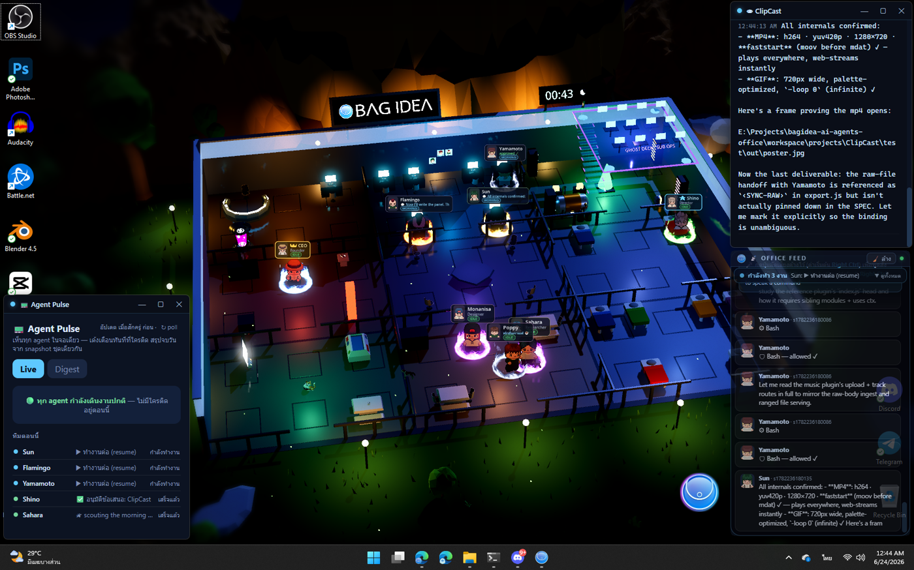

```
┌─ Overlay (Rust shell / browser) ────────────┐   ┌─ Godot 4 Wallpaper ────────────┐
│  chat·threads · settings · map · approvals  │   │  swappable 3×3 grid·countryside│
│            ▲ WebSocket /ws                  │   │  agents walk (A*) · FX · clock │
└────────────┼────────────────────────────────┘   │        ▲ WebSocket /ws  ▼ /pos │
             │                                    └────────┼────────────────────────┘
┌────────────┴─────────────────────────────────────────────┴───────────────────────┐
│  DAEMON (Node.js, zero-dep)                    http://127.0.0.1:8787              │
│  • broadcast + journal.jsonl (replay on connect) + registry.json + sessions.json  │
│  • POST /chat  → headless `claude -p` (persona+skills+tools, --resume threads)    │
│  • POST /event ← Claude Code hooks (your own sessions feed the world)             │
│  • POST /perm/request ←(long-poll)─ PreToolUse hook   POST /perm/respond ← UI     │
│  • /registry/* CRUD · /sessions/* · /discuss · /assist/prompt · /map/bg           │
└───────────────────────────────────────────────────────────────────────────────────┘
```

**三层架构**:Daemon(真相之源) + Godot 4 渲染(可重启,从 journal.jsonl 重建) + Browser overlay(只是个 Web 客户端)。Daemon 挂了不影响世界被渲染,Godot 挂了不影响 agent 继续干活(后面能 relaunch 重连)。

**WorkerW 监控**(Windows 的关键创新,v0.9.41):Windows 会因为用户换壁纸 / 锁屏 / 退出全屏游戏等操作杀掉你图标后面的 WorkerW 容器,BagIdea Office 自带「世界监督员」自动重新挂载到新的 WorkerW,**壁纸消失会自动恢复**。Linux Wayland 退回全屏 pinned-below 窗口。

### 2. 桌面端 chat 界面

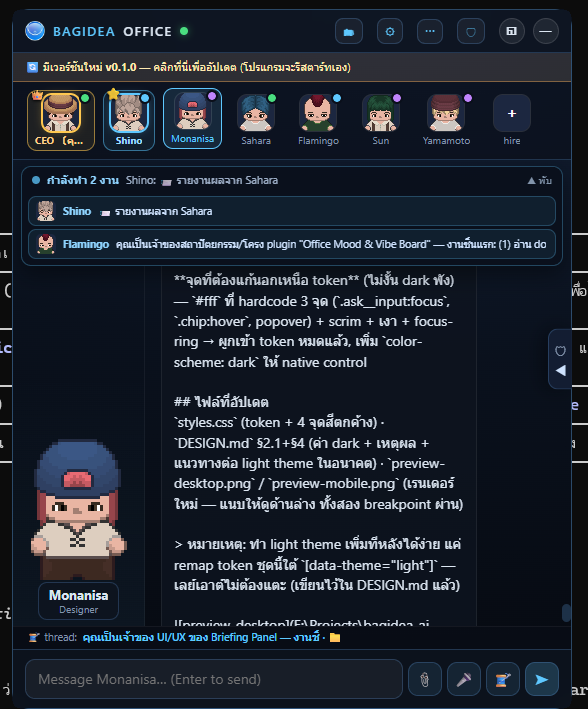

> 上图是 CEO 视角的桌面聊天窗口。注意右上角的消息标签 `🤖 Claude · 22.3k / 200k` 自动显示**当前对话所用模型 + 实时上下文占用**。

### 3. 3D 办公室编辑器

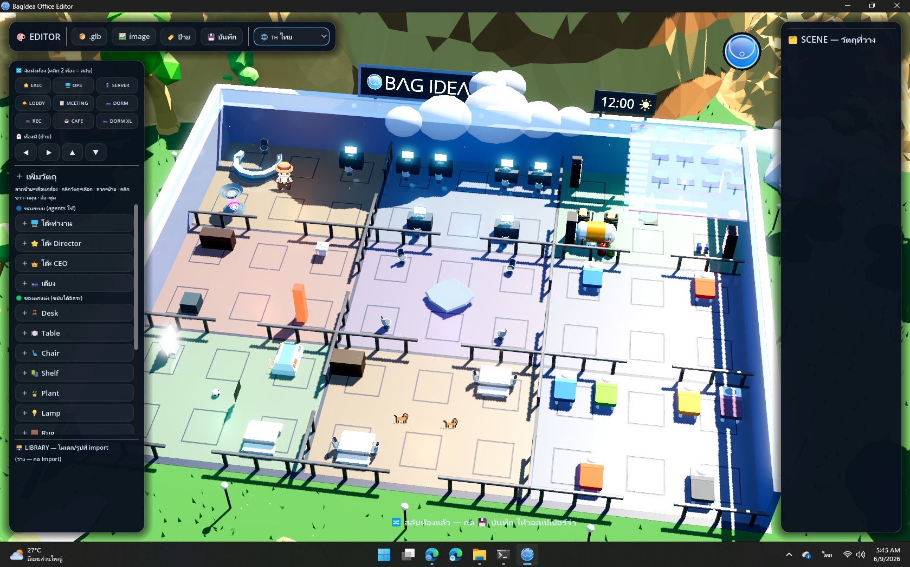

> **你能拖动小人换工位、换房间、换家具**,Godot 4 实时渲染(SSR + cinema pass),他们会自动走回自己工位,坐下,开始干活。

### 4. 小人自发开会的社交现场

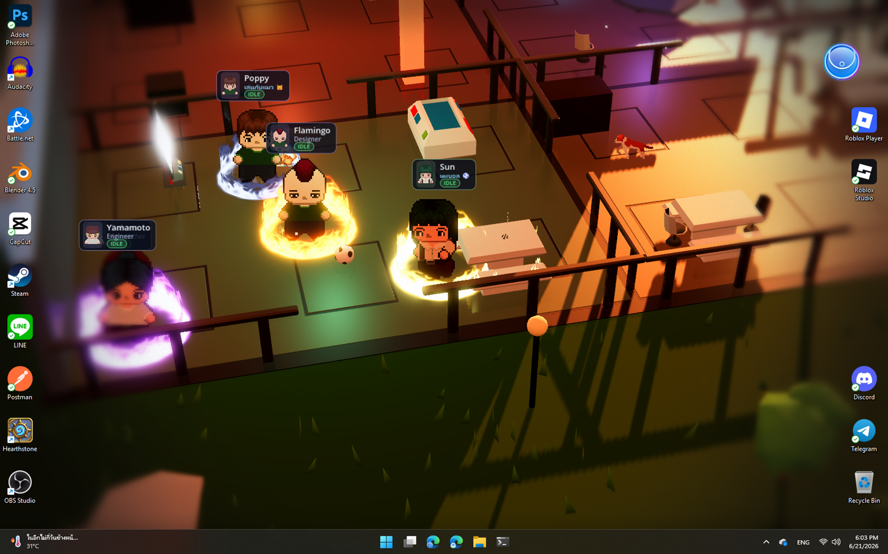

> 上图能看到多个 agent 聚在一起开会的瞬间,每个人身上有状态光晕(干活中 = 黄 / 开会中 = 紫 / 空闲 = 绿 / 错误 = 红)。

### 5. CLI 入口(给不想开图形界面的人)

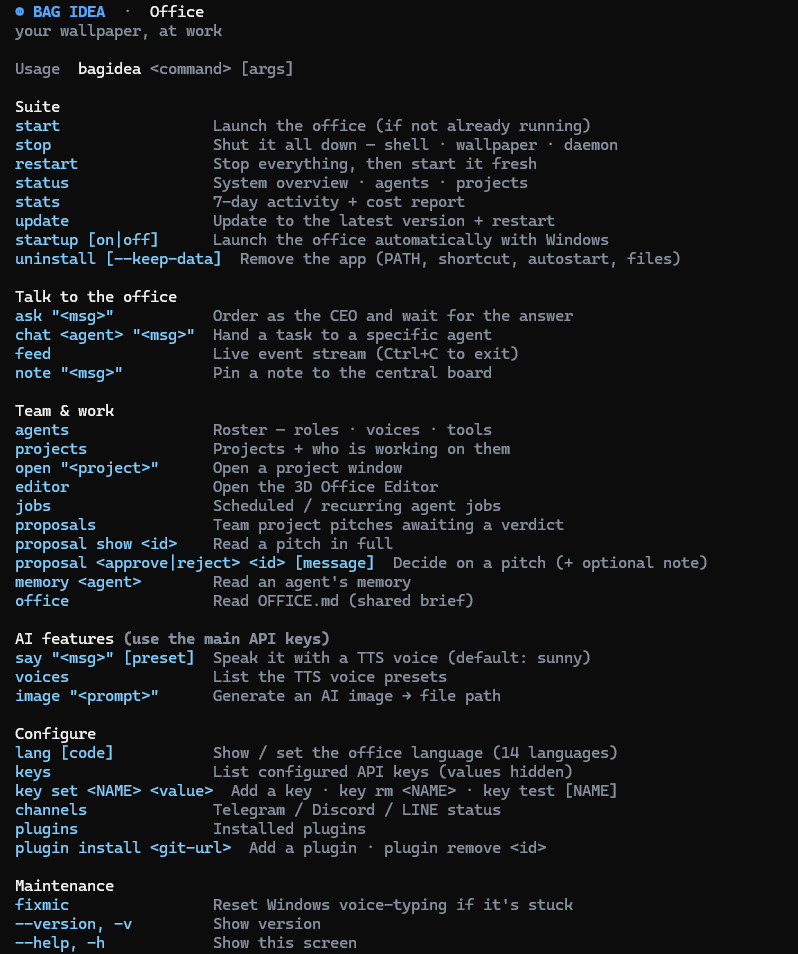

```bash
bagidea chat "<prompt>"          # 发给 CEO(Director 自动派发)
bagidea inbox                    # 看待办审批
bagidea approve <id>             # 批准
bagidea deny <id> --reason "..."  # 驳回 + 理由
bagidea hire --team dev-shop     # 一键雇整个团队(dev shop / research lab / content studio / customer support / solo assistant 5 套模板)
bagidea brains                   # 看每个 agent 用的什么模型
bagidea budget                   # 看成本
bagidea export / bagidea import  # 整办公室搬迁到新机器
bagidea eco on                   # 省 token 模式(空闲时不烧 token)
bagidea update                   # 自更新
```

### 6. Plugin 中心

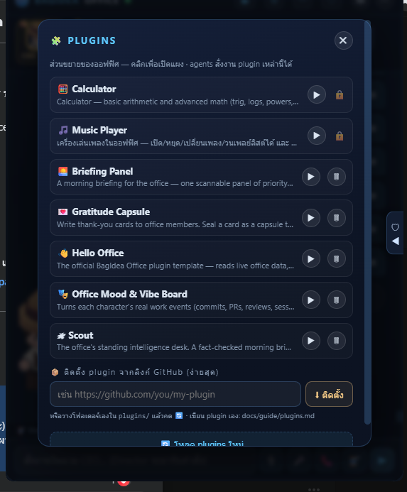

> 7 个官方 plugin 一键安装:**📣 Campaign Board / 📰 Content Pipeline / 🐙 GitHub Triage / 📬 Inbox Agent / 📊 Weekly Report / 🗂 Client Folders / 🧠 Decision Log**。Agent 自己写的 plugin 也会出现在这里,带「已批准」标签。

### 7. 早晨简报示例(plugin 实例)

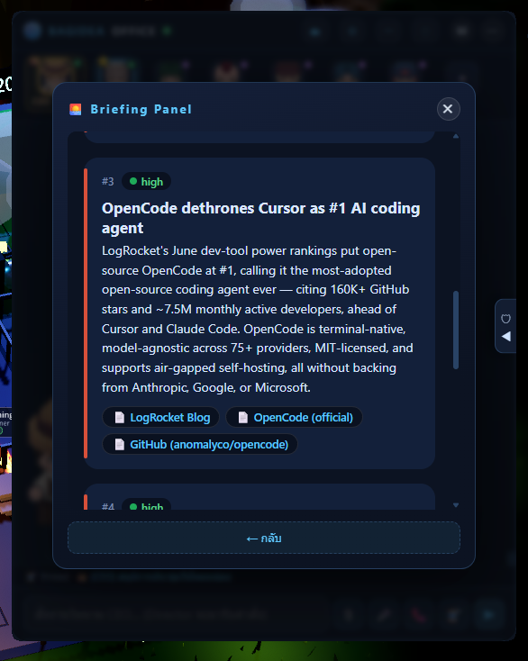

> Plugin 例子:周一早上自动拉过去一周的所有事件 + 决策 + 财务,生成 PDF 简报推送到你手机。

### 8. 模型大脑 — 每个 agent 独立配

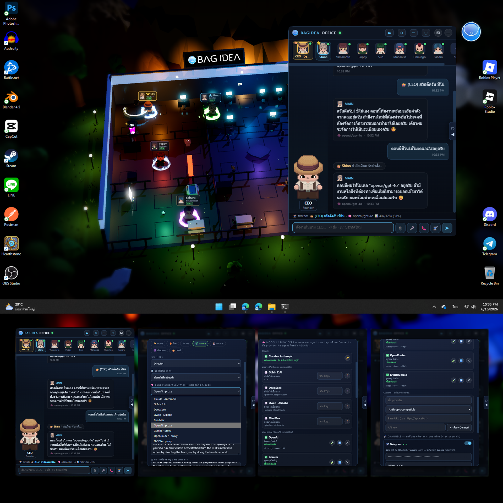

**核心创新**:**Claude Code 是引擎,大脑可换**。20 个内置供应商 + 你的自定义供应商:

| 类型 | 供应商 | 备注 |
|---|---|---|
| 🟢 **直连(Anthropic 协议)** | **Claude, GLM (Z.AI), DeepSeek, Qwen (通义千问), MiniMax, Kimi, Kimi Code** | CLI 直连,零依赖 |
| 🔵 **通过内置代理(OpenAI 协议)** | **OpenAI, Atlas Cloud, Gemini, OpenRouter, NVIDIA build, Groq, Cerebras, xAI (Grok), Mistral, Together AI, Fireworks + 自定义** | 自带零依赖 proxy 翻译 Anthropic ↔ OpenAI,**无需 LiteLLM / Python** |
| 💻 **本地零 API key** | **Ollama, LM Studio** | 接 localhost,免费、离线、隐私 |

**省成本示例**:Director(决定层)Claude Opus 4,builder(执行层)GLM-4.6,reviewer Groq Llama 3.1 — 三层模型协调,账单能砍一半甚至更多。

**20 个模型获取细节**:v0.9.47 起每个 provider 的 `/models` 端点**实时拉取**(启动后 20 秒刷新、之后每 12 小时、手动 ↻ Refresh 触发),Claude 模型当天发布当天可选。

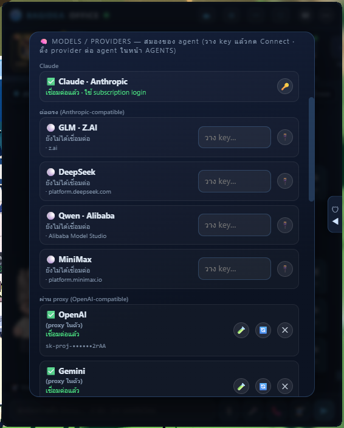

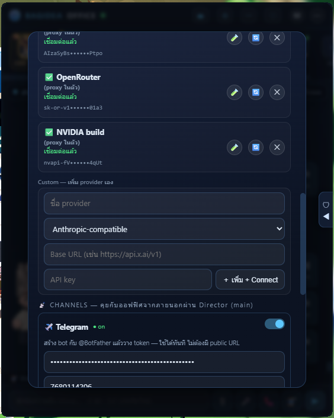

### 9. Auto-Compact + Auto-New-Thread — 对**每个**模型都管用

> **怎么聊都行,不会卡,不用你手动开新会话。**

普通长对话超出模型 context window 就崩 — Claude Code 只对 Claude 自身解了,BagIdea 让它对**所有 20 个模型**都生效,全自动:

- 🧠 **主动** — 每轮前测对话长度,80% → 用 Claude 总结 + 开新会话 + 灌摘要,继续干活
- 🛟 **被动** — 后端突然 reject(限流/超出),同样恢复
- 🪄 **连续性** — 摘要由 Claude(大脑子大 context)写,新会话完全继承;UI 自动跨 thread 把你的视觉跟过去

这意味着**免费 / 小模型也能跑长对话**,不用你守。

### 10. 聊天界面带模型 tag + 上下文占用表

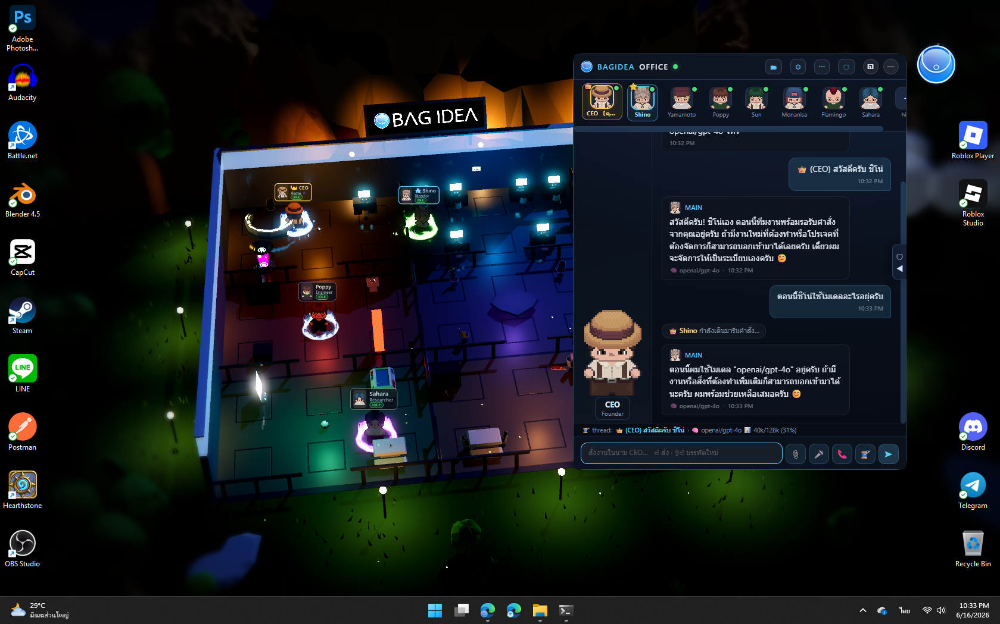

> 每条消息右下角显示所用模型,顶部进度条显示 `gpt-4o · 40k/128k` 实时占用。

## 完整功能矩阵(v1.6.3)

> **官方归类**(README 的 section "🆕 Recently shipped"):

| 版本 | 发布 | 核心 | 一句话 |
|---|---|---|---|
| **v1.6.3** | 2026-09-23 | local models 不再 500 | 把 Claude Code 的 system-reminder 折叠到 user 回合,strict chat template 的本地模型(Qwen3.5 等)不再崩 |
| **v1.6.2** | 2026-09 | 第 20 家模型 | Atlas Cloud + 修 delegated 错派 thread 的 bug |
| v1.6.1 | 2026-09 | 异常退出可见 | 死掉的 run 会在历史里写一行 `⚠ Run ended abnormally` 表明原因 |
| v1.6.0 | 2026-09 | skill 测试用例 | skill 自纠错时跑测试集,改坏了就**拒绝合并**,web/docs/pitch deck 全 14 语言同步更新 |
| v1.5.0 | 2026-08 | 7 个官方 plugin | Campaign Board / Content Pipeline / GitHub Triage / Inbox Agent / Weekly Report / Client Folders / Decision Log;5 套团队模板;9 个新工具集成 |
| v1.4.0 | 2026-08 | 一个 task board | todo/doing/waiting/done 拖拽,due date + 依赖 + 重复 + Codex 当系统工具 |
| v1.3.0 | 2026-08 | workflow 真跑起来 | 图执行 + 节点类型(Approval/Notify/Delay) + trigger (schedule/webhook/event/file/keyword) |
| v1.2.0 | 2026-08 | 成本有上限 | 按天 / 按 agent / 按 project 三层预算封顶,80% 警告 100% 停收新 turn |
| v1.1.0 | 2026-07 | 一个审批队列 | 所有审批(工具 / 项目钩子 / 团队 pitch / AUTO BLOCKED / 暂停 jobs)在一个 inbox 里,Telegram 远程批 |
| v1.0.5 | 2026-07 | 国际化修完 | 修复 agent 飘到泰语 bug(`personaText()` 把所有 persona 包在泰语头里),English office 不再说泰语 |
| v1.0.4 | 2026-07 | 空白窗口的根因 | 1) PowerShell 默认 Restricted 让 npm 装 claude-code 失败却报告成功 2) WebView2 透明被代理吃掉 → 嵌入页带三种原因说明 + `bagidea doctor` |
| v1.0.3 | 2026-07 | 输入框可读 | 🔎 SEMANTIC RECALL 字段被压成 22px、📦 RUN LOCATION 同病 → 端到端 layout 自动测 |
| v1.0.2 | 2026-07 | 文档跟产品同步 | 4 个新能力上网站 + 6 节 docs + 14 语言全翻译 + 16 个新测试 |
| v1.0.1 | 2026-06 | 14 语言真支持 | Tools 页只英/泰,79 个 catalog 字符串全翻译 + 3 个新 setting 用 ALL-CAPS 英文名 |
| v1.0.0 | 2026-06 | 五大能力落地 | Docker/SSH 远程跑 agent + ghost 隔离 + 语义 recall + 自纠错 skills + Media Studio |
| v0.9.54 | 2026-06 | Mac 2 fps 修 | 本地化 Dock 名匹配失败 → 改 bundle id + 多显示器按实际挂载 display 判断 |
| v0.9.50 | 2026-05 | 自进化哲学 | 「**a self-evolving, self-extending agentic AI ecosystem**」概念落地 |
| v0.9.49 | 2026-05 | 时钟不漂 | 系统时钟每秒采,分钟切换瞬间重绘 |
| v0.9.48 | 2026-05 | AUTO mode | agent 在自己权限内**自己开下一轮**(任务真完成才停) |
| v0.9.46 | 2026-05 | 大窗口 | ⛶ Large 真全屏 + 四边四角拖拽缩放 |
| v0.9.45 | 2026-04 | 五项加法 | 零 Anthropic 账号可用 + 整办公室 export/import + Gemini 思考模型 + 9 工具 + 语音 |
| v0.9.42 | 2026-03 | 文档覆盖 | README/网站/pitch deck 准确度 + coverage 全过 |
| v0.9.41 | 2026-03 | 壁纸不消失 | Windows WorkerW 监督员 + 调度真触发 |
| v0.9.40 | 2026-02 | 装哪儿都行 | 无 winget 装 Windows + 模型列表常新 + 媒体预览支持空格路径 |
| v0.9.x | 2026-02 | Linux 实验 | X11 真壁纸 / Wayland pinned-below + 18 模型 + Kimi Code |
| v0.8.0 | 2026-01 | **可换大脑(本版核心)** | Director Claude + builder 便宜模型 = 大幅省成本,所有 Claude Code 工具/技能/session 保留 |

## 安装

### 一键安装(推荐)

**Windows:**
```powershell
irm https://raw.githubusercontent.com/bagidea/bagidea-office/main/installer/install.ps1 | iex
```

**macOS:**
```bash
curl -fsSL https://raw.githubusercontent.com/bagidea/bagidea-office/main/installer/install-mac.sh | bash
```

**Linux(Ubuntu/Debian — 🧪 experimental):**
```bash
curl -fsSL https://raw.githubusercontent.com/bagidea/bagidea-office/main/installer/install-linux.sh | bash
```

### 通过 npm

```bash
npx bagidea
```

### 安装前置要求

| 组件 | 要求 |
|---|---|
| OS | Windows 11 / macOS 13+(beta) / Linux(experimental 🧪) |
| Renderer | [Godot 4.6+](https://godotengine.org/download) standard build |
| Daemon | [Node.js](https://nodejs.org) 18+(无 npm 依赖) |
| Agent | [Claude Code CLI](https://claude.com/claude-code) ≥ 2.x |
| Shell | Rust toolchain(`cargo`)— 或浏览器当 overlay |
| GPU | 任意 Vulkan 兼容,GTX 1060 6GB 验证通过 |

## 仓库结构

```
├── README.md                  ← 你在这里
├── docs/                      ← V1 product-design 10 篇文档
├── daemon/                    ← Layer 0 (Node.js, no npm install needed)
│   ├── server.js                  … WS hub + journal + registry + adapter + perms
│   ├── constants.js               … shared office constants
│   ├── tests/                     … 自动化 API 测试
│   ├── overlay.html               … Layer-2 web overlay
│   ├── hook.ps1 / perm.ps1        … Claude Code hook 转发
│   └── registry.json / sessions.json
├── godot/                     ← Layer 1 (Godot 4.6)
│   ├── scenes/office_floor.tscn   … 主场景
│   ├── scripts/grid_world.gd      … 可换 3×3 房间网格
│   ├── scripts/world_builder.gd   … 天空 / 乡野 / 时钟 / Ghost Deck
│   ├── scripts/agent_manager.gd   … events → 角色编排 + FX + 摄像机
│   └── scripts/agent_sprite.gd    … sprite sheet + aura + 身份
└── installer/                ← 一键安装脚本
```

## 性能

壁纸帧率:30 fps 上限,原生分辨率渲染 + MSAA 2×,SSR 精简,体积光换成 god-ray 卡牌,无 SSAO/DOF。GTX 1060 @1680×1050 测完整场景(countryside + 草地 + 云 + cinema pass)**占 GPU 20-30%**。被全屏 app 遮住时**整个渲染器暂停**,省电省 CPU。

## 跟同类项目对比

| 维度 | [Paseo](paseo.md) | [OpenOPC](openopc.md) | [OpenClaw AWD](openclaw-awd-arena.md) | **BagIdea Office** |
|---|---|---|---|---|
| 形态 | CLI | Phaser 浏览器 | Docker 容器 | Godot 4 桌面壁纸 |
| 模型切换 | 用户选 | 单模型 | 多模型池(对抗用) | **每 agent 独立配** |
| agent 数量 | 任意 | 任意(抽象) | 4-12(对抗用) | **5-20(有名字 + 工位 + 性格)** |
| 记忆/学习 | 无 | OFFICE.md | 无 | **OFFICE.md + per-agent memory + skills + archive** |
| 社交 | 无 | 无(静默) | **互打** | **自发开会 + 写提案** |
| 工具扩展 | 改代码 | 改代码 | 改容器配置 | **agent 自己提案 + 你批** |
| 安全 | 文档警告 | OFFICE.md | Docker 网络隔离 | **多道人门关 + 提案带理由驳回** |
| 桌面集成 | 无 | 无 | 无 | **真·壁纸 + Win+D 不暂停 + 语音/快捷键** |
| 学习曲线 | CLI 友好 | 部署复杂 | 部署复杂 | **一键安装 + 默认能跑 + 进阶可深** |

## 可借鉴元素

按对自己项目的启发度排序:

### 🏆 高启发(可平移的核心理念)

1. **「人门关 + 理由驳回」的 agent 安全设计** — agent 提案带你的驳回理由学下来下次不再提同类。这套机制可平移到任何多 agent 协作系统(自我进化的关键是「人记得你为什么不要」,而不是「人记得我做过什么」)。
2. **「Claude Code 当引擎、脑子可换」** — 不重写 agent runtime,只用 proxy 翻译协议。这套架构思想可平移到任何「想接多种 LLM 但不想重写 agent 系统」的项目。
3. **「三层真相架构」(Daemon / Renderer / Overlay)**,Renderer 死了可以从 journal.jsonl 重建,overlay 死了只是 UI。这套容错设计是任何「长跑型 AI 系统」的最佳实践。
4. **「OFFICE.md + per-agent memory + skills + archive」四层记忆体系** — 共享笔记 / 个人记忆 / 技能习得 / 可搜档案,知识真的能 compound。
5. **「AUTO(keep-going)模式 + 受限回合(8 round 上限)」** — 让 agent 自己开下一轮但**有边界 + 总是发审批**(v0.9.48)。这套「自主 + 不失控」的平衡方案比 OpenOPC 的「CEO 全权委托」或 Paseo 的「每条都要用户批」都更现实。

### 🥈 中启发(思路可借鉴,实现细节不同)

6. **agent 凑一起开会写提案的设计** — 比「CEO 调度一切」更接近真团队。要做到这点的关键是「让 agent 闲聊」+ 「闲聊沉淀为提案」。
7. **每 agent 独立模型配置 + 角色分级(Director / Builder / Reviewer)** — Director 用大模型做决策,Builder 用便宜模型做执行,Reviewer 用专门的模型做 critique。这套「模型角色分工」思路可平移。
8. **「Channel 镜像输出」机制** — Telegram / Discord / LINE / Slack / WhatsApp / Messenger 6 渠道,任何「决策点 / 阻塞点 / 完成点」都自动 push,你在哪都能批。
9. **「tray → Reload chat window」自救按钮** — WebView2 渲染死了不重启 daemon、不影响 agent 干活,只重建 page。这是任何 Electron / WebView2 应用必备的设计模式。
10. **`bagidea doctor` 无 daemon 自检**(v1.0.4)— 8 项检查(client 装没装、daemon 通不通、proxy 是否干扰),每项给 fix。这套「不依赖主进程就能自检」的思路可平移到任何有守护进程的 SaaS。

### 🥉 低启发(场景太特殊,只可看个新鲜)

11. **桌面壁纸模式**(Godot 4 + WorkerW 监督) — 场景太特定,除非你也做桌面应用,否则用不上。
12. **pixel 小人 sprite sheet + 真人配音** — 美术资源很重,自己有美术/声音设计师才玩得起。
13. **「真 · 小人自发开会」** — 这个独特性来自「模型足够便宜 + 模型之间通信无门槛 + agent 数量够多」,如果 agent 数量 < 5 就没有社交涌现,学不到这个。

## 跟 openopc / paseo 关系

| 项目 | BagIdea 引用 |
|---|---|
| [openclaw-awd-arena](openclaw-awd-arena.md) | 「agent-office 想法」来源 |
| Hermes (没在 iswiki,开源 agent 学 skill 框架) | 「agents learn skills on their own」机制来源 |
| OpenOPC | 「AI 原生公司模拟」概念 |

README 原文:**"takes inspiration from openclaw (the agent-office idea) and Hermes (agents that learn skills on their own) — folds in most of what those two do, then goes further"**。

## 限制 / 风险

| 维度 | 限制 |
|---|---|
| **macOS** | beta 状态,部分 wallpaper backend 问题 |
| **Linux** | 🧪 experimental,Wayland 退回 pinned-below 窗口 |
| **CLAUDE_CODE 是核心依赖** | 必须装 Claude Code CLI 才能用,**锁死 Anthropic 生态**。其他 19 家模型走 proxy,但 Claude Code 引擎本身闭源 |
| **228 stars / 73 forks / 0 open issues** | 2026-06 创建的项目,3 个月内冲到 228 ⭐,社区还很小,**单一作者 + 5 个 contributor**,bus factor = 6 |
| **Godot 4 渲染** | GPU 必备(虽然 GTX 1060 都行),不像 OpenOPC 纯浏览器 |
| **本地真跑 LLM** | Qwen3.5 等 strict chat template 模型跑长对话才有可能 500(v1.6.3 修了一半) |

## TL;DR

**BagIdea Office = 桌面壁纸上的 AI 办公室**。如果你是 solo dev / 小团队,把多个 Claude Code session 做成「有名有姓有工位有性格」的像素小人,让他们自己开会、自己提案、自己批 plugin — 这是目前「个人 AI 团队」赛道上**最完整的体感方案**。装一遍 `curl | bash` 就能跑,但要长期用需要 macOS 或 Windows,**Linux 仍是实验性**。模型路由 + 三层容错 + 桌面集成这三点是同类项目都没有的。

如果你只想「让 Claude Code 跑起来」,用 [Paseo](paseo.md) 就够;如果你想「看 agent 互打」,用 [OpenClaw AWD Arena](openclaw-awd-arena.md);如果你想「agent 像真同事一样坐在你工位旁边」,**这是目前唯一的选择**。

## 引用与参考

- 主页: https://github.com/bagidea/bagidea-office
- 官网: https://bagidea.github.io/bagidea-office/
- 文档站: https://bagidea.github.io/bagidea-office/docs/guide/getting-started.md
- Pitch deck: https://bagidea.github.io/bagidea-office/pitch/
- CHANGELOG: https://github.com/bagidea/bagidea-office/blob/main/CHANGELOG.md
- Discord: https://discord.gg/WpgGTzApw5
- YouTube: https://www.youtube.com/bagidea
- npm: https://www.npmjs.com/package/bagidea-office

## 跨 iswiki 引用

- [OpenOPC](openopc.md) — BagIdea 的概念源头之一
- [Paseo](paseo.md) — 同类多 agent 编排器,BagIdea 强在桌面集成,Paseo 强在 CLI 友好
- [OpenClaw AWD Arena](openclaw-awd-arena.md) — 同类 agent 编排,BagIdea 强调社交涌现,AWD Arena 强调对抗涌现
- [TeamAI CLI](teamai-cli.md) — 同类多 agent,BagIdea 强调桌面视觉,TeamAI 强调 Git-native
- [Matt Pocock skills](mattpocock-skills.md) — Hermes-style skills 借鉴源,BagIdea 的 skills 体系基于此
- [MiceInTheMuseum](MiceInTheMuseum.md) — 同一开发者 bagidea 的另一个项目(Google Arts & Culture 实验)

## 给 Claude / Cursor / Copilot agent 的 takeaway

1. **跨平台 desktop 集成** — WorkerW 监督机制 + WebView2 透明双方案 + tray 自救按钮,这套工程经验对任何 desktop AI app 都通用
2. **模型协议翻译代理** — 自带零依赖 proxy 转 Anthropic ↔ OpenAI,免 LiteLLM / Python,部署链路大幅简化
3. **「可控的自主」(AUTO + 8 round 边界 + 必发审批)** — 比「每条都要用户批」或「完全自主」都现实
4. **「三方真相架构」(Daemon / Renderer / Overlay)** — 长跑型 AI 系统的容错样板
5. **「OFFICE.md + per-agent memory + skills + archive」四层记忆** — 知识真能 compound 的关键

## 给 PM 的 takeaway

1. **「个人 AI 团队」赛道的体感标杆** — 228 stars / 3 个月增长,商业化潜力可期(可学习 [lobeHub](lobeHub.md) 的「AI 运营官」商业思路)
2. **三个差异化** — 桌面壁纸 + 自发开会 + 自己提案工具,这三点其他竞品都没
3. **三层预算(天/agent/project)+ 20 模型价格表** — 个人开发者也能精细化控制成本,适合「预算敏感型 SMB」
4. **5 套团队模板**(dev shop / research lab / content studio / customer support / solo assistant)— 把「养一群 AI 员工」产品化,降低使用门槛
5. **真正的护城河** — 不是模型/引擎(都是开源 + 开源 LLM),而是 **3 个月的实装经验 + 64+ 个 PR + 100+ 个修过的 bug**,这是工程壁垒