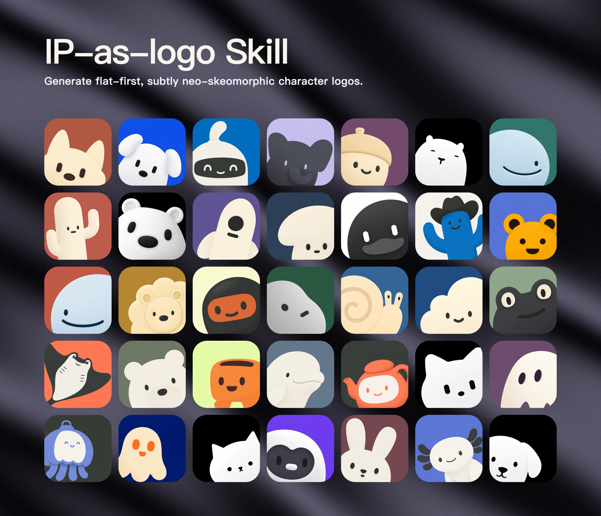

# ip-as-logo-skill — 把"极简圆润 IP logo"设计语言写成 SKILL 级硬约束

> 学习笔记 · 调研时间 2026-10-09 · 来源文章 2026-09-13
> 仓库: <https://github.com/s1dashu/ip-as-logo-skill> · 官网(独立 logo 库): <https://ipaslogo.com>
> License: MIT · 主文件: SKILL.md(17KB 单文件主导)+ README.md(7KB summary)+ assets/ + LICENSE + .gitignore
> ⭐ 5,867 · 285 forks · 200+ commits · 建仓 2026-08-18 · 最近 push 2026-08-22
> 调研来源: 公众号「史莱克learner」《5.1k 星的开源项目,把 AI 调教成了"logo 设计师"》(已用远端 SKILL.md/README.md 全文核验,数据校正见末段)
> **类别**: Agent Skill · 图片生成约束 · 多平台兼容(7 家)

---

## 0.5 配图速览

| 场景 | 截图 | 内容 takeaway |
|---|---|---|
| 项目官方 showcase |  | 直接感受"约束塑可爱"长什么样:每个 logo 都圆润、极简、三色封顶。35 个 logo 全部遵循 §4 规则——这就是"SKILL.md 把规则写死后, agent 每次生成的样子"。|

> 配图规范:WebP 优先(q85),2560×2200,源自上游 `assets/ip-as-logo-wall.webp`(2 个月前已被作者手动压缩)。本人不二次合成 logo,避免偏离事实,只用原仓库的样例展示作 §4 的视觉引子。

---

## TL;DR

仓库根目录就一个 `SKILL.md` 17KB 的 **纯文档型 Agent Skill**,把"圆润可爱、可商用、可缩到 32×32" 的 IP logo 设计语言,写成 GPT Image 2 / Seedance 5.0 Pro / Nano Banana Pro 等顶级图模型能稳定执行的 prompt 级 hard constraints。`npx skills@latest add s1dashu/ip-as-logo-skill` 一行装到 Codex / Coze / Doubao / **YouMind** / **Manus** / Gemini Apps / Replit Agent 7 家。下次跟 AI 说"画个 logo" 自动套规则 → 3 个方向 → 6 张候选(3 左下 + 3 右下, 永远 2 IP 色 + 1 背景色 = 三色)。核心范式:"**约束塑可爱**", 可与 [i-have-adhd](i-have-adhd.md)、[img2threejs](img2threejs.md)、[awesome-agent-skills](awesome-agent-skills.md) 对照阅读。

---

## 1. 一句话定位

把"极简、圆润、可爱、可商用" 的 IP 设计语言写成 agent **prompt 级硬约束**,让 GPT Image 2 等顶级图模型一次产出 6 张候选(3 左下探出 + 3 右下探出, 永远 2 IP 色 + 1 背景色 = 三色封顶, 不允许渐变/高光/阴影/居中)。

**与同类核心区别**:1) 不像社区 Midjourney prompt 攒,prompt 字段以 "Constraints:" 段**显式禁单**;2) 不像普通 logo 生成器,**prompt 永远不出现 `logo`/`brand mark`/`app icon`/`icon asset` 字眼**(SKILL.md 第 8 步强制);3) 不像 vendor 转换工具,**6 张是结构化的**(3 方向 × 2 变体 + 3-LL/3-LR 协议),不是 6 个自由发挥。

---

## 2. 核心数据

| 字段 | 值 |
|---|---|
| License | MIT(生成物 100% 归用户,可商用/可改) |
| 仓库体积 | < 30 KB(SKILL.md 17KB + README.md 7KB) |
| 兼容 agent | 7 家:Codex · Coze · Doubao · **YouMind** · **Manus** · Gemini Apps · Replit Agent |
| 强依赖图模型 | GPT Image 2(首选)· Seedance 5.0 Pro · Nano Banana Pro · Nano Banana 2 |
| 默认输出 | **6 张独立候选**(3 方向 × 2 变体,3 左下 + 3 右下) |
| 颜色封顶 | **3 semantic colors**(= 2 IP base + 1 background)|
| 形状封顶 | **4–7 large basic shapes** |
| 可识别尺寸 | **32 × 32 px** |
| 默认画布 | **1:1 square,~1536×1536**,模型原生 1254×1254 也接受 |

---

## 3. 它要解决的具体问题(公众号"症状 → SKILL 约束"对照表)

| AI 默认画法的痛 | SKILL.md 原文约束 |
|---|---|
| 出图有几十个形状, 缩到 32×32 糊一团 | "Complexity budget: 4–7 large basic shapes only, recognizable at `32 × 32`" |
| 颜色随意, 彩虹卡通 / 渐变 / 高光全开 | "3 semantic colors exactly: 2 IP base + 1 background, no gradients, no glossy hotspot, no cast shadow" |
| 主体居中或贴底 | "Composition: emerging from assigned lower-left or lower-right, 85–95%, never center or bottom-center" |
| 细节堆砌 / 表情杂乱 / 装饰压过主体 | "Strip textures, outlines, eyebrows, highlights, nostrils, fur tufts, armor plates, buttons, screws" |
| 提示词里 `transparent / alpha / opaque` 把图模型带偏 | "Do NOT use image-mode terms; name the desired solid background color directly" |
| 一次只出 1 张, 效率低 | "Propose 3 directions → user approve → emit 6 independent candidates A1–C2, 3 LL + 3 LR" |
| 自由发挥, 出图质量不稳定 | 提供完整 **7 段 Prompt 骨架**(Background / Subject / Complexity / Color / Composition / Style / Constraints) |
| `logo` / `brand mark` 字眼把模型带偏去做圆形背景+居中 | "Describe the requested visual as image only; never reveal logo/brand mark/app icon/icon asset use" |
| 失败就静默降级到 SVG | "Never fall back to SVG; require user to enable a suitable tool or provide its API key" |
| 重复抽图直到 "满意" 才给用户 | "One-pass batch: deliver every returned image as-is; do NOT inspect to block / rerank / retry / repair" |

---

## 4. 核心设计约束(技术原理)

> 上图墙(§0.5)里的 35 个 logo 已把 §4 的结果呈现在你眼前。下面用 §4 拆解"为什么会出这种样子"——不是凭空描述,是从 SKILL.md 17KB 原文里抽出的硬约束。

### 4.1 七段完整 Prompt 骨架(SKILL.md 全文给出,模式可抄)

```
Background:  fill the entire square with solid <background>
Subject:     place one extremely simplified, cute, endearing <subject>
Complexity:  4–7 shapes, at most two broad internal color regions,
             readable at 32×32
Color:       exactly 3 semantic colors: 2 IP base + background
Composition: upright, emerging from <LL|LR>, 85–95% of square
Style:       thick rounded contours, baby-like appeal,
             barely-there neo-skeuomorphic depth
Finish:      clean surfaces, normal square outer corners
Constraints: no text/watermark/border/frame;
             no fragile lines / sharp tips / decorative marks;
             no photoreal material, dramatic bevel, hotspot,
             cast shadow;
             background solid uniform, no texture/vignette/lighting
```

**拆解逻辑**:每段都在解决一个"AI 默认跑偏"的具体点。7 段加在一起是个 **contract 给 agent 用**, **不是给人写的咒语** —— 这解释了为啥 SKILL.md(17KB) 比 README.md(7KB) 长两倍。

### 4.2 6 张候选的分配协议(同样写死)

```
workflow pseudocode
──────────────────
parse(subject?, context)
  ├─ 上下文够 → 直接跳
  └─ 不够 → 一次合并提问(用途/受众/期望气质)

propose 3 directions (A/B/C)
  one line each: "<subject> — <product connection> — <defining silhouette>"
  user approval gate

emit 6 candidates:
  ┌─ 用户接受 3 方向 + 6 张 → A1,A2,B1,B2,C1,C2
  │    A1/B1/C1 → LL;  A2/B2/C2 → LR
  ├─ 用户选 1 方向 + 6 张 → A1–A6
  │    odd→LL;  even→LR
  ├─ 用户拒数量/分配 → 用户指令优先(不争辩)
  ├─ 偶数批(2/4/8/10) → 左右对半分
  ├─ 奇数批(3/5/7)    → 一侧+1,记录分布不均
  └─ center / bottom-center 仅当用户显式要求

style rule per candidate:
  ├─ exactly 3 colors  (2 IP + 1 background, no gradient)
  ├─ 4–7 shapes        (readable at 32×32)
  ├─ emerging from <LL|LR>, 85–95% of square
  ├─ paired features   (both ears / both horns / both wings — 都要画)
  ├─ no sharp corners / thin lines / texture / cast shadow
  └─ no 'logo' / 'brand mark' / 'app icon' 字眼进 prompt

delivery:
  one-pass creative draw → return ALL → never filter → never rerank
  → never auto-retry → never post-process → user 主动说才 refine
```

### 4.3 上下文探测协议(高复用价值)

**复制本段到任何需要上下文化的 agent skill**:

```
1. 读 README / docs / package metadata / manifest / design tokens
2. 仍不足 → 一次合并提问(不要 second round)
3. 够了 → 提 3 方向 → user 同意 → 出 6 张
4. refine 仅当 user 显式说
```

`i-have-adhd` 的"不问 6 轮 brainstorming"、本 skill 的" 1 轮合并提问 " 是同一种哲学: **agent 是工具, 不是陪聊**。

### 4.4 子 agent 并行(可选路径)

> SKILL 原文: "If the runtime supports subagents, parallelize the six independent candidates up to the available concurrency. Give every subagent the same product brief, shared constraints, and one assigned direction or variant."

→ 自适应设计:有 subagent 就并行 6 张, 没有就 sequential 6 次出图。**自己写 skill 时注意**: **不要假设 subagent 必可用**, 否则 fallback 路径要单独设计。

### 4.5 核心哲学(可单独引)

> "generation is a stochastic draw, not a conformance test" — SKILL.md Delivery 段
>
> "Make simplification, cuteness, and an endearing baby-like personality the decisive qualities." — SKILL.md Complexity budget 段
>
> "Constraints: Use no text or watermark. Add no borders, frames, cards, or presentation masks. Include one character only, with no extra subjects or scenery." — SKILL.md Prompt skeleton 末段

**"约束塑可爱"** —— 公众号原话的金句在 SKILL 里被工程化落地。

---

## 5. 与同类对比

| Skill / 工具 | 定位 | 与 ip-as-logo-skill 的关系 |
|---|---|---|
| **Anthropic `frontend-design`** | 让 agent 写生产级前端代码 | 🟡 都是 Design / UI 类;一个负责"生成设计稿",一个负责"实现设计稿" |
| **OpenAI `figma-*`(7 个)| Figma 设计 ↔ 代码对接 | ⚪ 工具链对接, 不解决"画什么" |
| **社区 logo 生成 prompt 集合** | 通用图模型 prompt 攒 | 🔴 反而是它的反义词 — 本 skill 显式禁 `logo` / `brand mark` 字眼 |
| **本仓 [i-have-adhd](i-have-adhd.md)** | 输出风格(action-first/numbered)| ✅ 同属 *Agent Skill* 范式,改 *输出节奏* vs *生成约束* |
| **本仓 [img2threejs](img2threejs.md)** | AI 看图生成 Three.js | ⚪ 上游不同;本 skill 出 .webp,img2threejs 吃图 |
| **本仓 [awesome-agent-skills](awesome-agent-skills.md)** | 1497+ skill 官方索引,70+ vendor | 🟡 本 skill 是它的 **典型样本**(高约束·高精度那一档)|
| **本仓 [reverse-skill](reverse-skill.md)** | AI Agent 路由 skill,57 模块 | ⚪ 不同主题(安全/逆向 vs 设计)|

**它在 Agent Skill 光谱上的位置**:

```
高约束 ◀━━━━━━━━━━━━━━━━━━━━━━━━━━▶ 低约束
                                   
ip-as-logo-skill   i-have-adhd   frontend-design   logo-prompt 集合
  (硬约束禁单)      (风格约束)    (中等约束)         (纯自由 prompt)
```

---

## 6. 安装 / 兼容性

```bash
# 项目内安装
npx skills@latest add s1dashu/ip-as-logo-skill

# 用户级(跨工程可用)
npx skills@latest add s1dashu/ip-as-logo-skill --global
```

**兼容 agent**(README 列的**完整 7 家**,非公众号的 5 家):

| Agent | 来源 | 项目内路径 |
|---|---|---|
| **Codex** | OpenAI | `.agents/skills/` |
| **Coze** | 字节跳动海外版 | `.coze/skills/` |
| **Doubao** | 字节跳动国内版 | `.doubao/skills/` |
| **YouMind** | 字节系(公众号漏列)| 同 Codex 路径族 |
| **Manus** | Monica(公众号漏列)| `.manus/skills/` |
| **Gemini Apps** | Google | `~/.gemini/config/skills/` |
| **Replit Agent** | Replit | Replit 工作区 |

**强依赖图模型**(README 排序):1) **GPT Image 2** 首选 → 2) Seedance 5.0 Pro → 3) Nano Banana Pro (Gemini Image Pro) → 4) Nano Banana 2 (Gemini Image Flash)。

→ **一个都没有**时, skill 要求用户显式 enable / 提供 API key,**不静默降级 SVG**。

**官方还显式允许**(manual consent) 在低质量图模型上跑,**README 警告**:
> "another image model may be used only with explicit user consent, with no guarantee of equivalent quality."

---

## 7. SKILL.md 工作流(12 步, 给你写自己的 skill 当 backbone)

> 引用 SKILL.md Workflow 段,中文整理为 12 步,所有 step 间关系如 §4.2 的 pseudocode 表:

| Step | 行为 | 备注 |
|---|---|---|
| 1 | 解析用户的 IP 主体 + 上下文;**不主动问**色板,除非用户显式 | |
| 2 | 读 readme/docs/manifest/design tokens 等只读上下文 | 上下文探测协议 |
| 3 | 上下文不足则**一次合并提问**(用途/受众/气质);不开第二轮 | |
| 4 | 上下文足 → 提 3 方向 + 提议 6 张;用户同意才生成 | |
| 5 | 方向必须有意图:用户指定主体 → 同一主体的 3 种处理;未指定 → 3 种真不同的 subject,**每个挂一个产品点** | 不能凑数 |
| 6 | 解析用户回复 → 决定分配协议(A1–C2 / A1–A6 / 用户自定义)| |
| 7 | 每张固定 3 semantic colors;遵守用户色板 | 不用 token / 不能动色 |
| 8 | 生成前 **必查 top-tier image model**;首选 GPT Image 2 | 无则问用户, 不降级 SVG |
| 9 | subagent 可用就并行 6 张, 否则 sequential | 自适应 |
| 10 | 用户色板里的色 → 全部 reserve 给背景(除非显式说不是) | |
| 11 | 每候选独立 square 资产;不问模型出 contact sheet | |
| 12 | **一次 draw, 全交付**;不 inspect、不 rerank、不自动 retry、不 post-process | 核心哲学 |

---

## 8. 跟我们的关系

**适合谁用**(原文 5 类,微调):

| 角色 | 用法 |
|---|---|
| **独立开发者** | SaaS/APP/小程序,想要"站在角落的小动物"。一行命令 6 张候选不花 3000 块 |
| **公众号 / 自媒体** | 缩到 32px 还能认的小动物,作栏目 logo / 小编头像 |
| **小公司 / 创业团队** | 早期请不起设计公司,要"像 Notion 一样可爱" 的初始形象 |
| **教育 / 课程 / 儿童产品** | 核心气质就是"极简 + 圆滚滚 + 婴儿脸",特别适合儿童读物 / 少儿编程 / 亲子 App |
| **AI 玩家** | "SKILL.md 怎么写 Agent Skill" 的范本之一(同 [i-have-adhd](i-have-adhd.md)、[img2threejs](img2threejs.md))|

### 8.1 可借鉴 3 件事

1. **"约束清单式 Skill" 范式** — [i-have-adhd](i-have-adhd.md) 用过 *output 风格*,ip-as-logo-skill 把同一思路推到 *生成式* 领域。把 "什么不该做" 显式写进 SKILL.md, **比堆 positive prompt words 稳定得多** —— 写自己的 skill 时, **default + Constraints 两列都要写**, 别只写 beautiful description。
2. **"3 directions → 6 candidates" 结构** — 把 "画 logo" 这种内在随机任务变得 *agent 可控*。如果未来自己写"帮 IP 起名 / 帮产品拍提纲 / 写 SEO meta",**先提 3 方向 → 再扩 6 候选**, 比"我从 0 开始想" 召回率稳。
3. **上下文探测协议** — "先读 README/docs/package metadata/design tokens" + "一次合并提问" — 不是 brainstorming 6 轮。可直接 copy 到所有需要上下文的 agent skill(同类的 skill 写法范本见 [OpenKimiPPTSkill](OpenKimiPPTSkill.md) · [CnDemSkill](CnDemSkill.md))。

### 8.2 别学的 1 件事

1. **"Open 多并行子 agent" 做高并发生成** — SKILL 提示有 subagent 时并行 6 张,但多数 runtime 跑不起来。**自己写 skill 不要假设 subagent 必可用**, 否则 fallback 路径要单独设计。

### 8.3 已知坑(SKILL.md 自己列的)

| 坑 | 解法 |
|---|---|
| 用户词 `opaque / alpha / transparency` | skill 强 transcribe 成 "solid <color>" 写入 prompt |
| 用户要 `center / bottom-center` | 仅当显式要求; 否则 strict 跳过 |
| 用户指定 IP 后想换 | 提供 refine, 但必须用户显式说, 不能 auto retry |
| 图模型并发 6 张 API rate limit | README 提了 "subsequent waves" 分波次 |
| 没 top-tier 图模型 | 不要 fall back to SVG,要求用户显式 enable / 提供 key |
| 用户要透明背景 | SKILL **显式拒绝**, 必须 naming 一个 solid 背景色 |
| 同色系过饱和(muddy / gray)| gently lower background saturation, 不改主体色, 改 user palette 时也保留用户主色 |

### 8.4 商业边界(MIT 协议下的 100% 归属)

> MIT 协议, 你的生成物 100% 属于你。拿去商用、改、做头像都行。如果它真帮你设计出"站在角落的小动物" — **去 GitHub 给作者点 ★**。

---

## 9. 数据校正(公众号 vs 远端核实)

| 用户口述 | 远端 README / GitHub API | 说明 |
|---|---|---|
| "5,163 ★" | 调研时 **5,867 ★**(9/13 → 10/09 这 26 天 +700, 增速 ~4%/周)| 数字会过期, 需重新查 |
| "免费商用 logo 库" | <https://ipaslogo.com> 真有,Supabase + Cloudflare R2 后端 | 可独立访问, 与 skill 解耦 |
| "支持 Codex / Coze / Doubao / Gemini Apps / Replit Agent" | README 实际列 **7 家**:Codex · Coze · Doubao · **YouMind** · **Manus** · Gemini Apps · Replit Agent | 公众号摘选,少了两家(YouMind / Manus) |
| "一次给你 6 张" | **3 directions × 2 variants = 6**, 路径"提 3 方向 → 用户同意 → 出 6 张" | 不是单步骤 |
| "永远 3 种颜色" | **2 IP base + 1 background = 3 semantic colors**;不许渐变/高光/阴影 | 公众号简化 |
| "从左下 / 右下探出" | 严格 **85–95% 占比**, 且 paired feature 双侧都画 | 简单提 corner 没提 paired |
| "极简 4–7 个形状" | README 是 summary;**17 KB SKILL.md** 还有 6 章硬约束 + 完整 prompt 骨架 + delivery 协议 + 失败处理 | 公众号引了 ≈1/4 |
| 总文件数 ≤ 30 | 实际根目录就 SKILL.md(17KB) + README.md(7KB) + assets/ + LICENSE + .gitignore | 文件极简 |

---

## 10. 一句话哲学(选段, 引用库)

> "Make simplification, cuteness, and an endearing baby-like personality the decisive qualities. Favor a large head, compact proportions, soft cheeks, widely spaced simple eyes, and a calm friendly expression when appropriate to the subject."
> — SKILL.md, *Complexity budget*

> "Constraints: Use no text or watermark. Add no borders, frames, cards, or presentation masks. Include one character only, with no extra subjects or scenery. Use no fragile lines, sharp tips, unnecessary outlines, tiny details, or decorative marks. Add no photorealistic material, dramatic bevel, glossy hotspot, deep occlusion, extrusion, strong three-dimensional rendering, or external cast shadow. Keep the background solid and uniform, with no texture, vignette, or lighting variation."
> — SKILL.md, *Prompt skeleton* 末段

> "generation is a stochastic draw, not a conformance test"
> — SKILL.md, *Delivery*

---

## 参考链接

- 仓库: <https://github.com/s1dashu/ip-as-logo-skill>
- 官网(独立 logo 库): <https://ipaslogo.com>
- SKILL.md 原文: <https://github.com/s1dashu/ip-as-logo-skill/blob/main/SKILL.md>
- README.md 原文: <https://github.com/s1dashu/ip-as-logo-skill/blob/main/README.md>
- 调研来源(公众号原文): <https://mp.weixin.qq.com/s/TJ_iMV-EQMgApQ9UQ_pNgA>
- 同类 Agent Skill 参考: [i-have-adhd](i-have-adhd.md) · [img2threejs](img2threejs.md) · [awesome-agent-skills](awesome-agent-skills.md) · [OpenKimiPPTSkill](OpenKimiPPTSkill.md) · [CnDemSkill](CnDemSkill.md) · [reverse-skill](reverse-skill.md)
- Agent Skill 开放格式(本 skill 实例): <https://officialskills.sh>
- 配图资产(展示样例): `assets/ipAsLogoSkill/01-source-showcase.webp` — 源自上游 `assets/ip-as-logo-wall.webp`,WebP 2560×2200,2 个月前已被作者压缩
