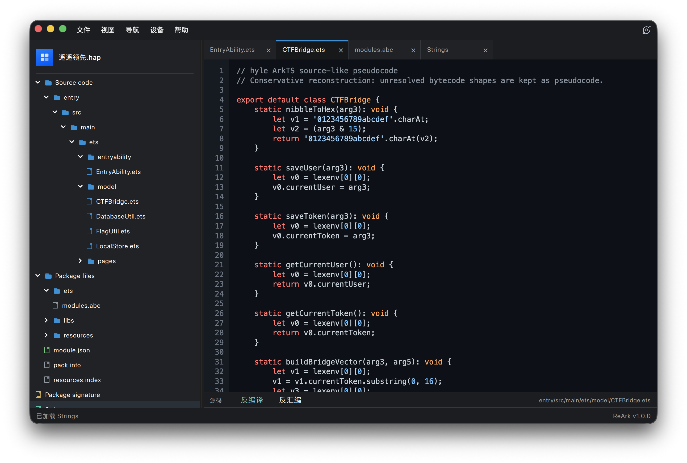
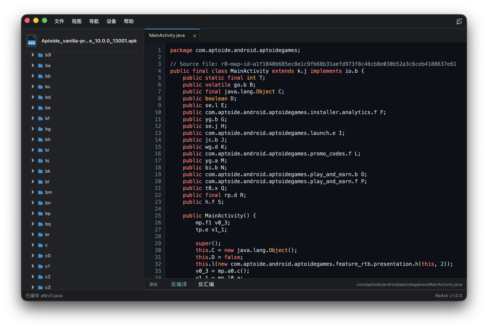
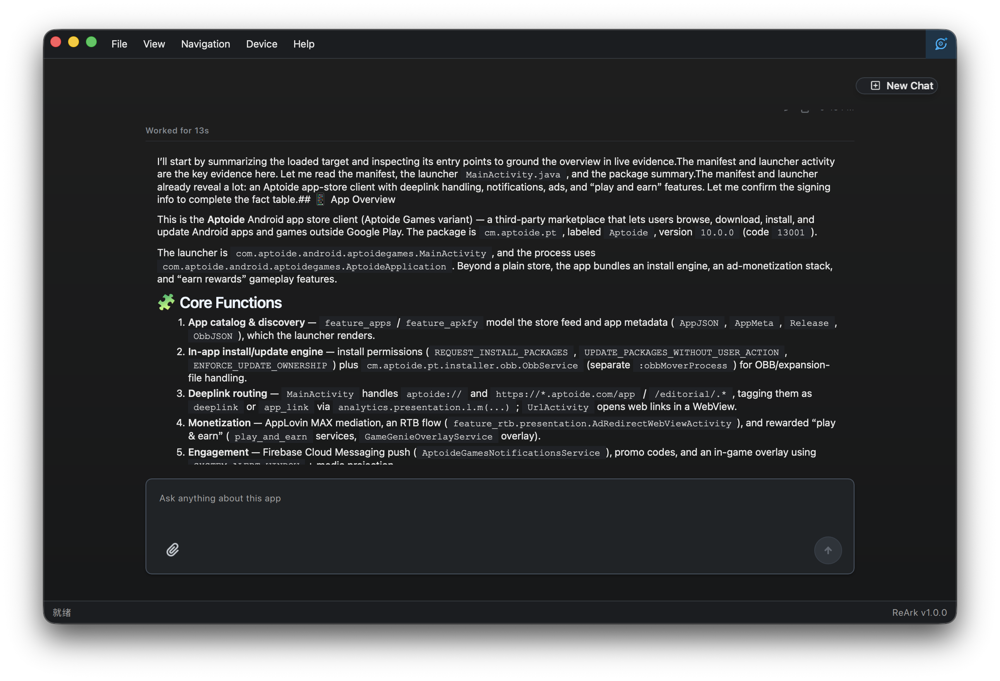
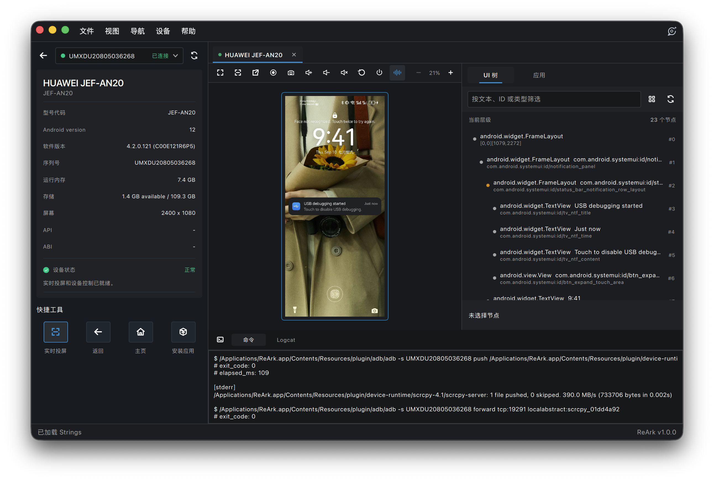

# ReArk — HarmonyOS + Android 桌面逆向 & AI 辅助分析工作台

> 学习笔记 · 调研时间 2026-09-15
> 仓库: <https://github.com/lkimuk/ReArk> · 中文 README: <https://github.com/lkimuk/ReArk/blob/main/README.zh-CN.md>
> Releases: <https://github.com/lkimuk/ReArk/releases> · 用户手册: <https://www.cppmore.com/category/ReArk/>
> License: **Apache-2.0** · 主语言: **C++ / QML / CMake** · ⭐ 365 · v1.0.0(2026-09-07)
> 主仓贡献者:lkimuk

---

## 0. 一句话定位

**ReArk 是一款桌面端「逆向 + 真机操控 + AI 问答」三合一工具**,把 HarmonyOS `.hap / .app / .abc` 与 Android `.apk / .aab` 的**静态分析、设备交互、LLM 辅助解读**整合在同一个工作区里,目标是替代「jadx + apktool + adb 脚本 + scrcpy + ChatGPT」这种「五件套来回切」的工作流。

== **核心设计哲学**:**「分析工作台」而非「单点工具」** — 一个界面贯穿「看代码 → 看资源 → 看签名 → 装真机 → 投屏操控 → AI 提问」全流程,不再搬上下文。==

---

## 1. 三种使用场景

| 场景 | 入口 | 适用人群 |
|---|---|---|
| **桌面 GUI 一站式分析** | 下载安装包(Win/Mac),双击 .hap/.apk 打开 | App 开发者 / 安全研究员 / CTF 选手(主力场景) |
| **命令行 / 脚本化** | 通过 ReArk Agent 触发 Python 与宿主命令 | 自动化批量分析、流水线集成 |
| **远程模型 + 本地模型** | ReArk Agent 配置 OpenAI 兼容接口 或 本地 Ollama | 涉密代码场景用 Ollama,日常用云端模型 |

---

## 2. 核心架构 / 模块

```
ReArk 桌面应用 (C++ + QML)
├── 静态分析层
│   ├── HarmonyOS 子系统
│   │   ├── HAP / APP 包结构解析
│   │   ├── ABC 字节码反汇编 + 反编译(类 Java 输出)
│   │   ├── 字符串 / 字面量 / 交叉引用 / 调用参数流
│   │   ├── 签名 / 证书 / 签名有效期检查
│   │   └── 重签名 + 重打包(配置签名材料 → 写回新包)
│   └── Android 子系统 (v1.0.0 新增)
│       ├── APK / AAB 包结构
│       ├── Manifest / 权限 / 组件 / 入口点
│       ├── DEX 反汇编 + 类 Java 反编译
│       └── 资源 / 应用图标 / 字符串
├── 资源预览层
│   ├── Hex 查看
│   ├── JSON / XML / 文本格式化
│   ├── 图片 / 媒体预览
│   └── 文件搜索 + 源码导航
├── 设备交互层
│   ├── HarmonyOS: HDC 发现设备 + 安装/启动/卸载
│   ├── Android: ADB 发现设备 + Shell / UI 自动化 / 截屏录屏
│   ├── 实时投屏(自适应缩放 / 旋转 / 全屏 / 独立窗口)
│   ├── 远程控制(PC 键盘输入 / 剪贴板同步 / 音量 / 静音)
│   └── HarmonyOS 7.0.0 专用兼容投屏运行时
└── ReArk Agent (LLM 层)
    ├── 语义路由(目标感知:鸿蒙 vs 安卓)
    ├── 渐进式能力发现(按需拉取元数据/反编译/字符串)
    ├── Python 执行 + 宿主命令(有授权流程)
    ├── 模型接入: OpenAI 兼容 / Ollama(本地)
    └── 上下文问答 + 附件参考资料
```

== **关键架构特征**:**「Agent 不直接调底层,而是先做能力路由」** — 用户问的问题先被路由到合适的分析能力(看元数据 / 看反编译 / 跑命令),按需取证据,不一次性把所有内容塞给模型。==

---

## 3. 安装与最小使用

### 3.1 平台与下载

| 系统 | 要求 | v1.0.0 下载 |
|---|---|---|
| Windows | Windows 10+, x64 | [Setup x64](https://github.com/lkimuk/ReArk/releases/download/v1.0.0/ReArk-1.0.0-windows-x64-setup.exe) |
| macOS | macOS 14.0+, **Apple Silicon** | [DMG arm64](https://github.com/lkimuk/ReArk/releases/download/v1.0.0/ReArk-1.0.0-macos-arm64.dmg) |
| Linux | x64 | **下个版本提供**(v1.0.0 暂未提供) |

### 3.2 最小使用(3 步)

```bash
# 1. 装好之后,双击 .apk / .hap 文件即可触发 ReArk 打开
#   (v1.0.0 新增 HAP / APP / ABC / APK / AAB 文件关联)

# 2. 工作区默认视图:左侧包结构 / 中间源码 / 右侧元数据

# 3. 接设备:鸿蒙走 HDC,安卓走 ADB(电脑端要装好对应 daemon)
adb devices    # 安卓要先看见设备
```

### 3.3 ReArk Agent 配置(LLM 接入)

```text
设置 → Agent → 模型服务
  ├── 云端: 填 OpenAI 兼容 endpoint + API key + 模型名
  └── 本地: 选 Ollama,确保 ollama serve 已起 + 模型已 pull
```

---

## 4. 截图(官方 README 截图)

### 4.1 鸿蒙反编译视图



== **图说**:中间面板是 ABC 反编译的「类 Java 输出」,右侧是元数据 / 调用流 / 字符串。鸿蒙 native 字节码(ABC)能反成类 Java 代码这件事,是 ReArk 在鸿蒙逆向圈的核心卖点。==

### 4.2 Android 反编译视图



== **图说**:v1.0.0 新增 — Android APK/AAB 走 DEX 反编译 + 类 Java 输出,左侧包结构支持模块视图。体验对标 jadx,但在同一工作区里能直接看 Manifest / 资源 / 签名,不用切工具。==

### 4.3 ReArk Agent 分析结果



== **图说**:Agent 路由后给出结构化回答 + 引用了哪些证据(包路径 / 字符串 / 调用流)。设计目标是「不把整个 APK 喂给 LLM,而是按需查」,隐私 + 上下文长度双友好。==

### 4.4 Android 实时投屏



== **图说**:scrcpy 风格的实时投屏,自适应缩放 / 全屏 / 独立窗口。PC 键盘输入直接进手机输入框,剪贴板双向同步 — 对动态分析、UI fuzz、跑通流程非常有用。==

---

## 5. 版本节奏 / Release 历史

| 版本 | 日期 | 关键变化 |
|---|---|---|
| **v1.0.0** | 2026-09-07 | 首个正式版:Android APK/AAB 支持 + macOS 支持 + HarmonyOS 7 投屏 + Agent 语义路由 + Java/XML 高亮 |
| v0.3.0 | 2026-07-16 | 设备运行时工作区优化 |
| v0.2.0 | 2026-07-07 | 设备运行时交互改进 |
| v0.1.0 | 2026-06-15 | 首个公开版(Windows only, HarmonyOS 起步) |

== **节奏判断**:**2026-05-29 仓创建 → 06-15 v0.1.0 → 09-07 v1.0.0**,约 3.5 个月到正式版,属于「快速出 MVP + 快速迭代」节奏。v1.0.0 是「鸿蒙 → 双端」的关键拐点。==

---

## 6. 跟用户已有项目的关联

| 项目 / 场景 | 怎么用上 |
|---|---|
| **CTF 安卓题 / 鸿蒙题** | 直接当主力工作台用:反编译 + 投屏动态验证 + Agent 辅助解释协议,一套走完 |
| **自有 Android App 安全审计** | 当作 jadx + apktool + scrcpy 三件套的替代,减少工具切换 |
| **鸿蒙 App 分析(国内政企 / 鸿蒙开发者)** | **现阶段唯一能用的桌面逆向工作台之一**,ABC 反编译是杀手锏 |
| **AI 辅助代码理解** | ReArk Agent 的「按需证据 + 路由」思路比「一键喂全部 APK」更适合隐私敏感场景,可以学 |

== **对你工作的差异化**:**国内开发者特别关注鸿蒙适配** — 国内 Android / HarmonyOS 双端需求在 2026 年是真实存在但工具链稀缺的赛道,ReArk 的「鸿蒙 ABC 反编译 + 重签名」是当下为数不多的成熟方案。如果要做鸿蒙逆向相关的项目,这是必看工具之一。==

---

## 7. 风险点 / 理性判断

| 风险 | 说明 |
|---|---|
| **生态刚起步** | v1.0.0 才发布,插件 / 第三方扩展 / 社区经验沉淀远不如 jadx / IDA / Ghidra |
| **macOS 仅支持 Apple Silicon** | Intel Mac 用户暂无法使用(macOS 14.0+ 还要求 arm64) |
| **Linux 缺位** | v1.0.0 不提供 Linux 包,需要等下个版本 |
| **Agent 远程模型泄露风险** | 用云端模型时,**包内容会上传到 LLM 服务端** — 自有 App / 商业代码场景慎用,优先 Ollama 本地模型 |
| **ABC 反编译准确性** | 鸿蒙 ABC 是相对新的字节码格式,反编译结果对复杂混淆 / 控制流平坦化的处理还没经过大量样本验证 |
| **稳定性早期** | 现有 10 个 open issues 集中在 Agent 报错 / macOS 兼容性 / UI 冻结 — v1.0.0 还在快速迭代 |

---

## 8. 配套生态

- **用户手册**:<https://www.cppmore.com/category/ReArk/>(作者自己维护的官方文档站)
- **同类工具**:
  - **jadx** — Android DEX 反编译(ReArk 的「类 Java 输出」体验接近它)
  - **apktool** — Android 资源 / Manifest 拆解
  - **scrcpy** — Android 投屏(ReArk 投屏体验对标它)
  - **Ghidra / IDA Pro** — 通用反汇编(ReArk 走 ABC / DEX 字节码,不直接和它们竞争 native binary 场景)
  - **鸿蒙端** — **目前没有同等量级的桌面工具**,ReArk 几乎是孤品
- **第三方依赖**:Font Awesome Free(图标,CC BY 4.0)

---

## 9. 参考链接

### 一手
- GitHub: <https://github.com/lkimuk/ReArk>
- 中文 README: <https://github.com/lkimuk/ReArk/blob/main/README.zh-CN.md>
- v1.0.0 Release: <https://github.com/lkimuk/ReArk/releases/tag/v1.0.0>
- Issues: <https://github.com/lkimuk/ReArk/issues>(v1.0.0 发布后 10 个 open)
- 用户手册: <https://www.cppmore.com/category/ReArk/>
- 第三方声明: <https://github.com/lkimuk/ReArk/blob/main/THIRD_PARTY_NOTICES.md>

### 中文介绍(2026-09)
- 公众号「天若源码教程实战」— [APK 逆向又多一个新选择:ReArk v1.0.0 支持安卓,还能在电脑上直接控真机](https://mp.weixin.qq.com/s/_Rc2EN_vO85NC5XOB4rIQA)(2026-09-08,小码)— **本文笔记的辅助理解来源**,作者从用户角度给出「工具链替代视角」的评价,结论是「补充工具而非全面替换」