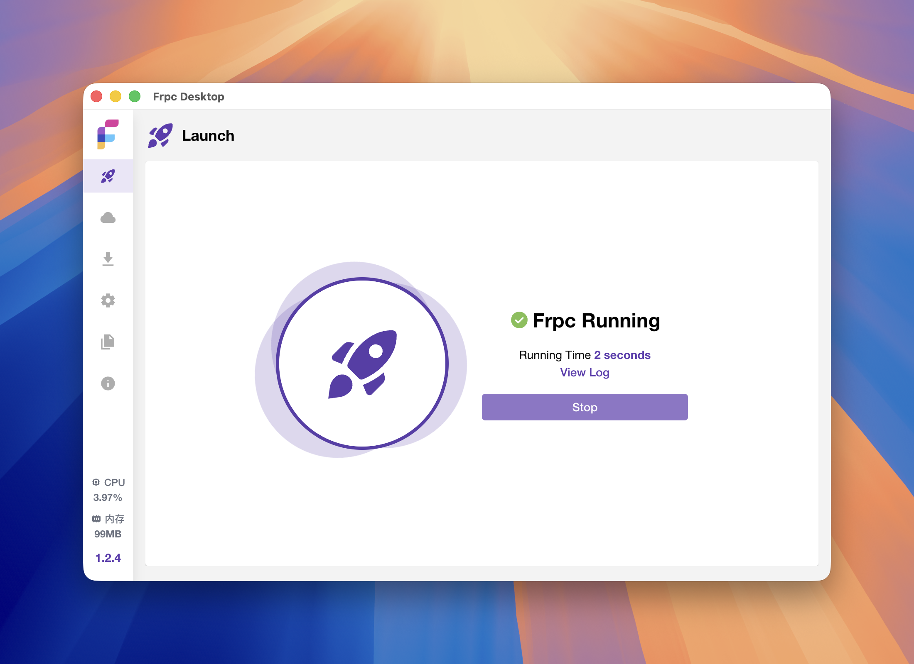
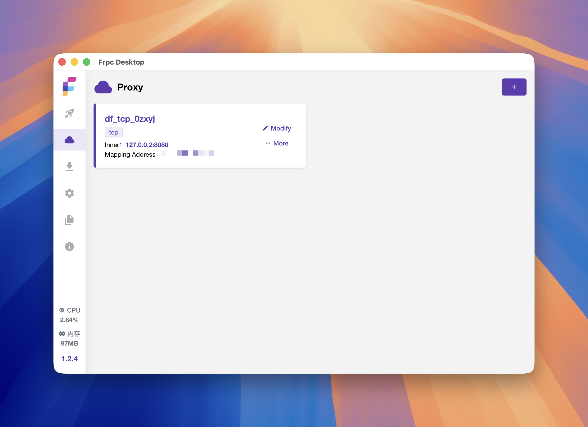
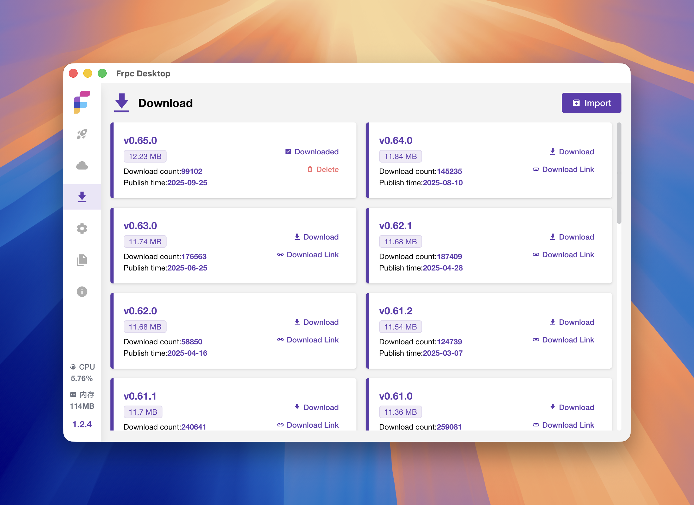
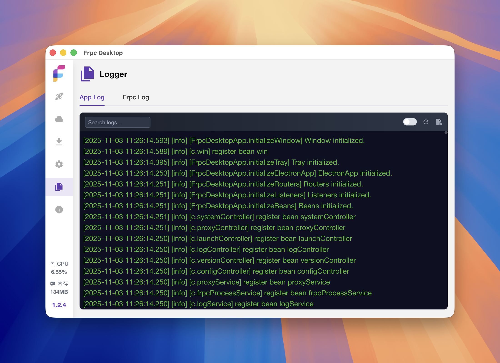

# Frpc-Desktop — FRP 内网穿透跨平台桌面客户端(可视化配置)

> 学习笔记 · 调研时间 2026-09-15
> 仓库: <https://github.com/luckjiawei/frpc-desktop> · 中文 README: <https://github.com/luckjiawei/frpc-desktop/blob/main/README.zh_CN.md>
> 官方文档: <https://jwinks.com/p/frp/> · FAQ: <https://jwinks.com/p/frpc-desktop-faq/>
> Releases: <https://github.com/luckjiawei/frpc-desktop/releases>
> License: **MIT** · 主语言: **TypeScript / Vue** · ⭐ 6,875 · v1.2.7(2026-09-07)
> 主仓贡献者:luckjiawei(刘嘉伟)
> 收录榜单:HelloGitHub 精选 / Trendshift 12489 位

---

## 0. 一句话定位

**Frpc-Desktop 是 fatedier/frp 客户端(`frpc`)的官方风格之外的「桌面 GUI 替代品」** —— 跨 Win/macOS/Linux 三平台,把原本需要手写 `frpc.toml` + 命令行启动的内网穿透配置,变成**可视化增删改查 + 一键启动/停止 + 内置 frp 二进制版本管理**的桌面应用。

== **核心设计哲学**:**「小白用户也能跑 frp」** —— 通过 Electron + Vue 3 抹平了「下载二进制 → 写 toml → 配 systemd / 计划任务」的运维门槛,但底层仍然是真实的 `frpc` 子进程,配置文件可双向导入导出。==

---

## 1. 三种使用方式

| 场景 | 入口 | 适用人群 |
|---|---|---|
| **桌面 GUI 一次性配置** | 下载安装包 → 双击 → 填表单 | 不想碰 toml 的开发者、NAS 玩家、自建服务用户(主力场景) |
| **命令行 / 嵌入式集成** | 不适用(GUI 专属) | 想脚本化请直接用官方 frpc |
| **同作者 Web 版(Podux)** | <https://github.com/luckjiawei/podux> | 需要从浏览器管理 frpc 的场景 |

---

## 2. 核心架构 / 模块

```
Frpc-Desktop (Electron + Vue 3 + Vite + TS)
├── 渲染层 (renderer / Vue 3)
│   ├── Element Plus (组件库,选择性注册以减少 bundle)
│   ├── Tailwind CSS 4 (样式)
│   └── 视图: 启动 / 代理管理 / 配置 / 下载 / 日志 / 关于
├── 主进程层 (electron main)
│   ├── better-sqlite3 持久化(v1.2.7 起替代 NeDB)
│   ├── frpc 进程管理
│   │   ├── 启动 / 停止 / 重载
│   │   ├── 进程树清理
│   │   ├── 跨平台兼容(Win/macOS/Linux)
│   │   └── 日志捕获(支持 partial chunk + macOS 文件日志)
│   ├── IPC 通信(renderer ↔ main)
│   └── Auto-launch(开机自启)
├── frp 二进制管理
│   ├── 内置版本列表(GitHub releases)
│   ├── 下载代理选择(支持镜像站)
│   ├── 多 frp 版本并存(用户切换)
│   └── 与系统适配的 native binary 派发(Win/macOS/Linux)
├── 代理配置 (visual editor)
│   ├── 支持协议: TCP / UDP / STCP / XTCP / HTTP / HTTPS
│   ├── 批量端口(TCP/UDP 一键多端口)
│   ├── 导入/导出 frpc.toml(双向识别)
│   ├── 一键清空配置
│   ├── 卡片 / 列表双视图 + 分页 + 防抖搜索
│   └── HTTP Locations / Basic Auth / 子域名 / Proxy Protocol
└── 平台支持
    ├── Windows 10+ x64
    ├── macOS 14+ (Intel + Apple Silicon,universal 包)
    └── Linux x64
```

== **关键架构特征**:
1. **不替代 frpc,而是包裹 frpc** —— 真正的流量转发由官方 frpc 子进程负责,Frpc-Desktop 只做「配置生成 + 进程管理 + UI」,所以**对 frp 所有新协议 / 新版本支持都几乎零延迟**(只要 frp 发了新版本,工具能马上下载并切换)
2. **NeDB → SQLite(v1.2.7)** —— 迁移原因:配置 / 代理 / 版本数据的「可靠持久化」,首启自动迁移 NeDB 数据并归档为只读备份
3. **进程事件驱动**(v1.2.7 改进) —— 从「轮询状态」改为「事件驱动 + 状态去重 + 恢复退避」,减少不必要的 IPC 和渲染刷新==

---

## 3. 安装与最小使用

### 3.1 平台下载(全部为 GitHub Releases 一键安装)

| 系统 | 要求 | 下载 |
|---|---|---|
| Windows | Windows 10+, x64 | Setup exe |
| macOS | macOS 14+,universal(Intel + Apple Silicon) | DMG |
| Linux | x64 | AppImage / deb / rpm |

每次 release 提供 **26 个资产**(不同平台 + 架构 + 便携版),v1.2.7 文件可在 <https://github.com/luckjiawei/frpc-desktop/releases/tag/v1.2.7> 找到。

### 3.2 最小使用(3 步)

```text
1. 装好启动 → 「启动」页面配 frps 服务端(地址 / 端口 / 密钥)
2. 「代理」页面新增代理:选协议 + 填本地服务端口 + 远程端口
3. 点「启动」按钮 → 日志面板看 frpc 是否成功连上 frps
```

### 3.3 配置文件互操作

```bash
# 已有 frpc.toml?直接在「配置」页导入,工具会识别并生成等价可视化配置
# 反过来,在 GUI 配完后「导出 frpc.toml」可给其他纯命令行环境用
# 配合 remote-obd 那套「N1 + VirtualHere + FRP/XTCP」的场景,
# 这套工具特别适合给小白玩家一次性配通 frp
```

### 3.4 macOS 常见问题

```bash
# 如果提示「App 已损坏」(未公证):
sudo xattr -cr Frpc-Desktop.app
```

---

## 4. 截图(官方 README 截图)

### 4.1 启动页 — frps 配置入口



== **图说**:启动页是 frpc-desktop 的「主入口」,顶部 frps 服务端配置(地址 / 端口 / 密钥 / 用户),下方是当前 frpc 状态(已连接 / 未连接 / 错误)和最近日志摘要。设计上把「服务端配置」和「状态展示」分两层,避免「配在哪、看在哪」的混乱。==

### 4.2 代理管理 — 卡片视图



== **图说**:核心场景 — 增删改查代理条目。卡片视图(v1.2.0 后)让「批量端口」场景直观可见,每个卡片显示协议、本地端口、远程端口、状态、启停按钮。v1.2.7 加了分页 + 防抖搜索,代理数量上百也不卡。==

### 4.3 frp 版本下载



== **图说**:内置 frp 二进制版本管理 —— 用户可以选已发布的 frp 版本(从 GitHub releases 或镜像站下载),存在本地并切换。这种「工具自带版本管理」的设计免去了「去哪下载 frp / 怎么放路径 / 怎么 PATH」的折腾。==

### 4.4 配置页 — TOML 双向编辑


== **图说**:「配置」页提供 TOML 直接编辑能力 —— 高级用户可以绕过 UI 直接手写配置,工具也会识别导入的 TOML 并生成等价 UI 表单。这种「GUI + 源文件双向同步」让工具不被 UI 限制能力。==

### 4.5 日志面板



== **图说**:实时日志(支持 partial chunk + macOS 文件日志兼容,见 v1.2.7 修复),用于排查 frpc 启动失败 / 连接错误 / 协议握手问题。==

---

## 5. 版本节奏 / Release 历史

| 版本 | 日期 | 关键变化 |
|---|---|---|
| **v1.2.7** | 2026-09-07 | **NeDB → SQLite 迁移**、代理分页 / 防抖搜索、tray + 进程生命周期修复、事件驱动状态监控 |
| v1.2.6 | 2026-05-21 | 下载代理选择(科学上网 / 镜像) |
| v1.2.5 | 2026-03-26 | Bug 修复 |
| v1.2.3 | 2025-09-10 | **支持 Proxy Protocol** + 性能优化 |
| v1.2.2 | 2025-04-22 | 支持 HTTP Locations |
| v1.2.1 | 2025-03-25 | 英文支持 |
| v1.2.0 | 2025-03-06 | **底层重构,稳定性大幅提升**(NeDB→SQLite 的前置) |
| v1.1.5 | 2024-12-04 | 优化体验 + 解决 GitHub rate limit + 日志优化 |
| v1.1.3 | 2024-10-14 | 支持 **XTCP 协议** |
| v1.1.0 | 2024-09-07 | 支持批量端口 + 单条代理开关 |
| v1.0.8 | 2024-08-17 | 支持 STCP 代理 |
| v1.0.2 | 2024-01-29 | Linux 客户端 + 代理模式 |
| v1.0 | 2023-11-28 | 首个公开版(Windows) |

== **节奏判断**:
- 2023-11 创建 → 2023-11 首个 v1.0(快速 MVP)
- 2024 是「功能补齐 + 跨平台」:Linux 客户端(1.0.2)、STCP(1.0.8)、XTCP(1.1.3)
- 2025 是「底层重构 + 高级特性」:1.2.0 重构、1.2.3 Proxy Protocol
- 2026 是「稳定性打磨 + UX 优化」:1.2.7 的 SQLite 迁移 + 事件驱动监控
- 整体属于「长尾运维类工具」的典型稳定节奏,3 年 26+ release 没断更,在国内 frp 生态里属于头部项目==

---

## 6. 跟同类工具的对比

| 工具 | ⭐ | 平台 | 技术栈 | 维护 | 跟 frpc-desktop 的差异 |
|---|---|---|---|---|---|
| **luckjiawei/frpc-desktop** | 6,875 | Win/Mac/Linux | Electron + Vue 3 | 活跃(2026-09) | **跨平台 + 社区体量第一** |
| koho/frpmgr | 2,052 | **Windows only** | Go | 活跃 | 性能 / 体积更优,但 Win only |
| codemonkey-m/FrpClient-Win | 319 | **Windows only** | C# WinForms | 维护中 | 轻量,但功能比 frpc-desktop 少 |
| MoonProxyHQ/moonproxy-desktop | 58 | Mac/Win | Tauri v2 + Vue 3 + Rust | 早期 | **新一代技术栈**(Rust 后端),但功能 / 生态远不及 frpc-desktop |
| jlucaso1/frpc_gui_flutter | 5 | 跨平台 | Flutter | 早期 | 实验性 |

== **关键判断**:**frpc-desktop 在「跨平台 frp GUI」这个赛道几乎没有对手** —— 第二名 frpmgr 只支持 Windows,跨平台用户(尤其是 macOS / Linux NAS 玩家)基本只能用 frpc-desktop 或命令行。==

---

## 7. 跟用户已有项目的关联

| 项目 / 场景 | 怎么用上 |
|---|---|
| **remote-obd-deep-analysis / remote-obd-usb-over-ip** | 那套 N1 + VirtualHere + FRP/XTCP 方案,**frpc-desktop 可以替代手写 frpc.toml 那一段** —— 在 N1 / Mac / Windows 上可视化配 XTCP 代理,比 SSH 进去手写配置文件直观太多 |
| **nas / 自托管服务穿透** | 家里的 NAS / 树莓派 / 开发板跑 frpc,本地用 frpc-desktop 配 → 远程能访问 |
| **frp 教学 / 培训** | 给非运维同事 / 学生讲解 frp,GUI 比手写 toml 直观很多 |
| **批量内网穿透服务(企业内)** | 跨 Win/Mac 团队统一配置,可走「导出 frpc.toml → 团队分发」的混合模式 |

== **对你工作的差异化**:**远程 OBD 那套笔记已经踩过 frp 的坑**,现在补 frpc-desktop = 把「命令行配置」升级为「可视化配置」。如果以后再做类似「内网穿透 + 远程硬件接入」类笔记或项目,这套工具值得直接当作案例引用。==

---

## 8. 风险点 / 理性判断

| 风险 | 说明 |
|---|---|
| **依赖 GitHub releases 下载 frp** | 国内网络环境下,frp 二进制下载可能不稳定 —— v1.2.6 加了「下载代理选择」是缓解,但仍需用户自己配代理 |
| **Electron 应用体积 / 内存占用** | Electron + Element Plus + better-sqlite3,安装包和内存比 Go/Rust 方案大得多;老电脑 / 低配 NAS 上跑会偏重 |
| **better-sqlite3 native binding** | macOS universal 包构建坑多(README 已有「x64ArchFiles」小节提醒),从源码 build 的话要备好对应 C++ 工具链 |
| **未公证 macOS 包** | 首次启动会被 Gatekeeper 拦,需要 `xattr -cr` 手动放行 |
| **frp 协议支持跟随官方节奏** | 工具自己不实现协议,所以**官方 frp 一旦引入 breaking change,工具需要等发版才能跟上**(历史上节奏很快,通常几天到一周) |
| **SQLite 迁移历史包袱** | v1.2.7 之前是 NeDB,跨大版本升级时偶有数据迁移报告(项目 v1.2.7 已处理并自动归档备份) |

---

## 9. 配套生态 / 同作者作品

- **同作者 Web 版 Podux**:<https://github.com/luckjiawei/podux>(浏览器端 frpc 管理器,适合远程统一管控多台 frpc)
- **官方 frpc 命令行版**:<https://github.com/fatedier/frp>(frpc-desktop 的「底层」,这个项目完全依赖它)
- **同类 GUI 客户端**:
  - koho/frpmgr(Go,Win only)
  - MoonProxyHQ/moonproxy-desktop(Tauri+Rust,跨平台新尝试)
  - jlucaso1/frpc_gui_flutter(Flutter,跨平台实验)
- **文档站**:<https://jwinks.com/p/frp/>(作者维护的官方文档,比 README 更细)
- **第三方支持**:Telegram 群 + 微信公众号(200+ 人,需关注官方账号获取入群方式)

---

## 10. 参考链接

### 一手
- GitHub: <https://github.com/luckjiawei/frpc-desktop>
- 中文 README: <https://github.com/luckjiawei/frpc-desktop/blob/main/README.zh_CN.md>
- v1.2.7 Release Notes: <https://github.com/luckjiawei/frpc-desktop/releases/tag/v1.2.7>
- Issues: <https://github.com/luckjiawei/frpc-desktop/issues>(当前 21 个 open)
- 官方文档站: <https://jwinks.com/p/frp/>
- FAQ: <https://jwinks.com/p/frpc-desktop-faq/>
- 捐赠: <https://jwinks.com/donate/>(个人项目,作者公开接受捐赠)
- HelloGitHub 收录: <https://hellogihu.com/repository/b0dc116e9f2e4b8188da5a6d3e1bd8a4>
- Trendshift 排行: <https://trendshift.io/repositories/12489>

### 同作者
- Web 版 Podux: <https://github.com/luckjiawei/podux>

### 底层依赖
- fatedier/frp(官方 frpc 命令行版,frpc-desktop 内部调用):<https://github.com/fatedier/frp>

### 关联笔记
- [remote-obd-usb-over-ip](../remote-obd-usb-over-ip.md) — 已用 frpc / XTCP 的命令行方案;frpc-desktop 可作为 GUI 替代
- [remote-obd-deep-analysis](../remote-obd-deep-analysis.md) — 同上技术栈的深度分析