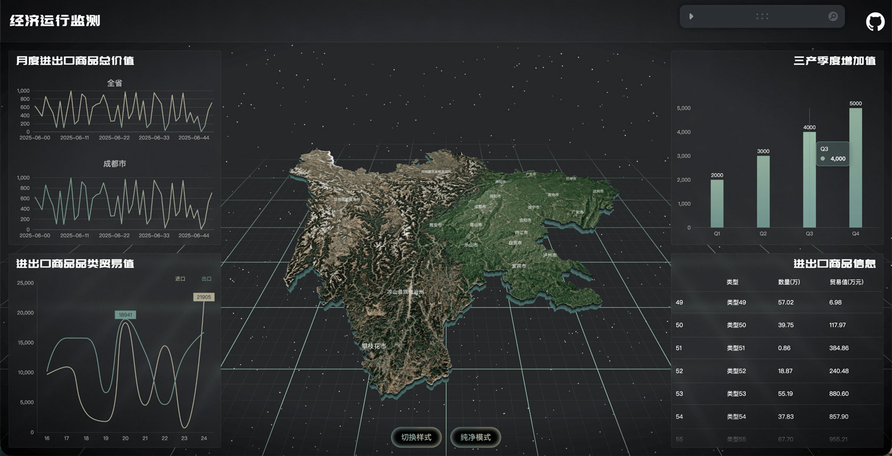
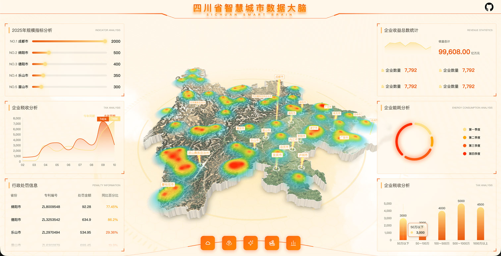

# scDatav — Three.js + React 19 数据可视化大屏（同一张地图做出 4 种风格）

> 学习笔记 · 调研时间 2026-10-08
> 仓库: https://github.com/knight-L/sc-datav · 在线 Demo: https://knight-l.github.io/sc-datav/
> 微信公众号原文: <https://mp.weixin.qq.com/s/LYidAL6CzFNvguTzsgAGGg>（*这套开源大屏，把一张地图做出了三种风格*，2026-10-04）
> 配套工具: https://github.com/knight-L/sat-hunter（区域卫星瓦片底图下载，Vue，⭐ 288，Apache-2.0）
> License: **Apache-2.0** · 语言: TypeScript · ⭐ **2,424** · 🍴 482 · 创建 2025-11-11 · 最近 push **2026-03-13**（维护已停 ~7 个月）
> 无 release / 无 tag，package.json `version: 0.0.0` + `private: true` → **只能 clone 不能装包**





## 一句话定位

**一张四川省 GeoJSON 边界，用 D3-geo 投影 + Three.js 挤出成 3D 地图，ECharts 铺周边图表** —— 4 个 Demo 分别演示「地形贴图」「热力起伏」「蓝色立体电力风」「GLB 模型拆解」四种大屏风格，Apache-2.0 可商用，是**换数据即交付**的省时模板而非通用库。

## 三种使用方式

| 方式 | 入口 | 适用场景 |
|---|---|---|
| **在线看效果**（零成本） | `https://knight-l.github.io/sc-datav/#/demo0` ~ `#/demo3` | 判断风格是否对味，不下载 |
| **clone 改地区**（主路径） | `git clone https://github.com/knight-L/sc-datav` → 换 `src/assets/*.json` + 贴图 → `pnpm i && pnpm dev` | 自己的省份/城市大屏（推荐） |
| **只抄单个模块** | 拷 `src/pages/Demo*/map/*.tsx` + `src/components/chart.tsx` 到自己项目 | 自己已有 React + R3F 栈，只缺 3D 地图和图表封装 |

⚠️ 不是 npm 包（`private: true` + 无 tag/release），没有 `pnpm add sc-datav` 这条路。

## 4 个 Demo 对照表

| Demo | 地图风格 | 关键技术点 | 源码目录 |
|---|---|---|---|
| **Demo0** | 地形纹理 + 灰绿经济监测 | `sc_map.png` + `normalMap` + `displacementMap` 三张贴图；外轮廓 `ExtrudeGeometry` 挤出成侧边；侧边扫光 shader | `src/pages/Demo0/` |
| **Demo1** | 米白底 + 橙黄热力图 | `keli-heatmap.js` 双画布（彩色 + 灰度），灰度 alpha 驱动顶点高度 → 热力有起伏 | `src/pages/Demo1/` |
| **Demo2** | 深蓝立体电力风 | `shaderMaterial` 按顶点高度算扫光带；光柱 `Points` + 自定义 shader；`shiftMaterial` | `src/pages/Demo2/` |
| **Demo3** | 灰底 GLB 展台 | `useGLTF` 加载 35 MB 风机模型，Leva 开关控制 2234 式散开/还原 | `src/pages/Demo3/` |

> 公众号原文只讲了 Demo0/1/2 三种，**Demo3（GLB 模型拆解）是原文漏掉的第四个**，GitHub README 的预览图里其实有。

## 核心架构

```
sc-datav/
├── vite.config.ts              # base: "/sc-datav/" ⚠️ 硬编码 GitHub Pages 子路径
├── src/
│   ├── App.tsx                 # react-router: / /demo0 /demo1 /demo2 /demo3
│   ├── assets/
│   │   ├── sc.json             # 四川 21 市州边界（高德 GeoJSON，283 KB）
│   │   ├── sc_outline.json     # 省级外轮廓（78 KB）
│   │   ├── sc_map.png          # 地形颜色贴图（968 KB）
│   │   ├── sc_normal_map.png   # 法线（1.1 MB）/ sc_normal_map1.png（3.3 MB，Demo2 用）
│   │   ├── sc_displacement_map.png  # 位移（1.0 MB）
│   │   └── heatmapData.json    # 54 个点，properties.value = 1774 这种
│   ├── components/
│   │   ├── chart.tsx           # ⭐ ECharts 封装（懒加载 + replaceMerge + 300ms 防抖 resize）
│   │   ├── autoFit.tsx         # autofit.js 大屏缩放适配
│   │   └── seamVirtualScroll.tsx / numberAnimation.tsx / button.tsx
│   ├── hooks/                  # useSize / useDebounceEffect / useAnimationFrame / useRafInterval / useMoveTo
│   └── pages/
│       ├── Index/              # 落地页（BentPlaneGeometry 曲面 + ScrollControls）
│       └── Demo{0,1,2,3}/      # 每个 Demo: map/(3D) + panel/(ECharts 图表) + stores/(zustand)
```

### 技术栈（精确版本，来自 package.json）

| 层 | 选型 | 版本 |
|---|---|---|
| UI Runtime | React | 19.1.1 |
| 3D | **three** | **^0.183.2** ⚠️ README badge 写 0.181.2，@types/three 却锁 ^0.181.0 |
| 3D React 层 | @react-three/fiber / drei | ^9.4.2 / ^10.7.6 |
| 后期 | @react-three/postprocessing | ^3.0.4 |
| 图表 | **echarts** | ^6.0.0（`echarts/core` 按需引入 + `echarts.use()`） |
| 地理投影 | d3-geo + topojson-client | ^3.1.1 / ^3.1.0 |
| 热力 | **keli-heatmap.js** | ^2.0.18（`//@ts-ignore` 引入，无类型） |
| 动画 | gsap | ^3.13.0 |
| 状态 | zustand | ^5.0.8 |
| 调参面板 | leva | ^0.10.1 |
| 大屏适配 | autofit.js | ^3.2.8 |
| 样式 | styled-components | ^6.1.19 |
| 路由 | react-router | ^7.9.6 |
| Build | **Vite 8**（Rolldown 版本） | 8.0.0 |
| Type | TypeScript | ~5.9.3 |

### 地图投影与立体建模（Demo0 核心）

**投影只有一行**，关键是 `center` + `translate([0,0])` 让地图落在场景原点：

```tsx
// src/pages/Demo0/map/index.tsx
const projection = useMemo(() => {
  return geoMercator()
    .center(data.features[0].properties.centroid)  // 取首个区域的质心做中心
    .translate([0, 0]);
}, []);

// <Center top> + rotation={[-Math.PI/2, 0, 0]} scale={0.8} 旋转到水平面
```

**外轮廓挤出成地图侧面**（`drei` 的 `<Extrude>` 包一层）：

```tsx
// src/pages/Demo0/map/outline.tsx
<Extrude
  args={[
    new Shape(
      coordinates.map((coord) => {
        const [x, y] = projection(coord as [number, number])!;
        return new Vector2(x, -y);      // ⚠️ Y 取反：地理 Y 向上，场景 Y 向下
      })
    ),
    { depth: 0.5, bevelEnabled: false }, // depth = 侧边厚度；false = 直边
  ]}
/>
```

**地形贴图的 UV 重算**（`src/pages/Demo0/map/shape.tsx`，全仓最值得抄的 30 行）：多个区域的 `ShapeGeometry` 各自带一套 UV，直接贴图会每个区域都重复一遍整张地形。做法是先算全图 `Box2` 包围盒，再把每个顶点位置归一化到 0–1：

```tsx
const width  = bbox.max.x - bbox.min.x;
const height = bbox.max.y - bbox.min.y;
for (let i = 0; i < pos.count; i++) {
  const x = pos.getX(i), y = pos.getY(i);
  uv.push((x - bbox.min.x) / width, (y - bbox.min.y) / height);
}
geometry.setAttribute("uv", new Float32BufferAttribute(uv, 2));
```

### 热力起伏（Demo1 的巧思）

同一个数据集喂给**两个** heatmap 实例：彩色画布当颜色贴图，**灰度画布的 alpha 通道参与顶点高度计算**，热力区因此在 3D 上凸起来：

```tsx
// 灰度图 → 顶点 shader
const frgColor = texture2D(greyMap, uv);
float height = z_scale * frgColor.a;      // z_scale 默认 4.0
vec3 transformed = vec3(position.x, position.y, height);

// 彩色图 → 片元 shader
gl_FragColor = vec4(u_color, u_opacity) * texture2D(heatMap, vUv);
```

三个可调旋钮：**扩散半径**（覆盖范围）、**颜色梯度**（数值呈现）、**z_scale**（凸起程度）。

### 流光与扫光

| 效果 | 实现 | 关键参数 |
|---|---|---|
| 边界流光（Demo0） | 沿轮廓 `CatmullRomCurve3.getSpacedPoints(800)` 采样，每帧 `slice(50)` 一段往前挪；点大小按 `percent` 顶点属性两端细中间亮 | 速度 `60 * delta`、段长 `num=50`、重采样 200 点 |
| 侧边扫光（Demo0） | `meshPhysicalMaterial.onBeforeCompile` 注入 GLSL，按顶点高度算亮带位置，随时间循环 | `uRiseTime` 每帧 +0.003，到 0.5 归零重置为 -0.8 |
| 侧面扫光（Demo2） | `drei` 的 `shaderMaterial` 封装，`normalizedHeight = position.z / depth`，`fract(time)` 驱动亮带上移 | `bandHeight = 0.45` |

### ECharts 封装（`src/components/chart.tsx`）

React 集成 ECharts 的标准写法，可直接搬走：

```tsx
const memoOption = useMemo(() => props.option, [props.option]);

useLayoutEffect(() => {
  chart.current = echarts.init(chartBox.current!);
  return () => { chart.current?.dispose(); chart.current = null; };
}, []);

useDebounceEffect(() => {
  if (size?.width !== 0 && size?.height !== 0) chart.current?.resize();
}, [size], 300);   // ← 300 ms 防抖，连续调尺寸不重绘

useEffect(() => {
  chart.current?.setOption(memoOption, {
    notMerge: false,
    lazyUpdate: true,
    replaceMerge: ["series"],   // ← 换指标数量时用新 series 替换旧的
  });
}, [memoOption]);
```

## 数据格式（换地区必看）

### `sc.json` — 行政区边界（高德 GeoJSON 格式）

```jsonc
{
  "type": "FeatureCollection",
  "features": [
    {
      "type": "Feature",
      "properties": {
        "adcode": 510100,                    // 高德行政区划码
        "name": "成都市",
        "center":     [104.065735, 30.659462],  // 行政中心（画 Label 用）
        "centroid":   [103.931804, 30.652329],  // 几何质心（投影 center 用）
        "childrenNum": 20,
        "level": "city",
        "parent": {...},
        "subFeatureIndex": ...,
        "acroutes": [...]
      },
      "geometry": {
        "type": "MultiPolygon",
        "coordinates": [[[[lon, lat], ...]]]     // 4 层嵌套
      }
    }
    // 共 21 个 feature = 四川 21 市州
  ]
}
```

**代码实际只读 3 个字段**：`properties.name`、`properties.centroid`、`properties.center`（`centroid ?? center` 兜底）。换数据保留这 3 个就够，但**坐标嵌套层级必须和现有解析一致**（Demo0 用 `coordinates.reduce(...)` 逐层 flatten，GeoJSON 标准 3 层 / 高德 4 层都能吃）。

### `heatmapData.json` — 热力点

```jsonc
{ "type": "Feature", "id": 1,
  "properties": { "gid": 1, "geometry": "Point", "value": 1774 },
  "geometry": { "type": "Point", "coordinates": [103.931804, 30.652329] } }
```
共 54 个点，`coordinates` = `[lon, lat]`，`properties.value` = 指标值。

## 最小可运行示例

```bash
git clone https://github.com/knight-L/sc-datav
cd sc-datav
pnpm i          # 锁文件是 pnpm-lock.yaml，用 npm 也行
pnpm dev        # vite dev server
pnpm build      # tsc -b && vite build
pnpm preview
```

部署 GitHub Pages（仓库自带 `.github/workflows/publish.yml`）。⚠️ 自建域名必须改 `vite.config.ts` 的 `base: "/sc-datav/"`。

换数据改三处（原文的二次开发段落，实测有效）：

```tsx
// src/pages/Demo0/panel/chart1.tsx —— 把 Math.random() 换成接口返回
const rows = [
  { date: "2026-10-01", value: 120 },
  { date: "2026-10-02", value: 156 },
];
const dateList = rows.map((r) => r.date);   // → xAxis[].data
const valueList = rows.map((r) => r.value); // → series[].data
```

> 原文提醒的两个细节都对：① 示例里「全省」和「成都市」**共用同一份 `valueList`**，接真实数据要拆成两组并同步改标题/单位/tooltip；② **请求失败时保留上次数据 + 显示更新时间**，避免旧值被当成实时值。

## 资源体积（clone 前先知道）

| 文件 | 大小 | 说明 |
|---|---|---|
| `public/model/glb/turbine.glb` | **35.1 MB** | Demo3 风机模型，单文件占全仓一半 |
| `src/assets/sc_normal_map1.png` | 3.3 MB | Demo2 法线贴图 |
| `src/assets/heatmapData.json` | 19 KB | 54 个点 |
| `src/assets/sc.json` | 283 KB | 21 市州边界 |
| `public/hdr/venice_sunset_1k.hdr` | 1.4 MB | Demo3 环境光 |

→ 只要 Demo0/1/2 的话，删掉 `public/model/` 和 Demo3 可省 35 MB，clone 体积从 ~70 MB 降到 ~35 MB。

## 坑点 / 风险

| 坑 | 位置 | 说明 |
|---|---|---|
| **`min`/`max` 写反了** | `Demo1/map/heatmap.tsx` | `const max = 1000; const min = 2000;` —— min > max。keli-heatmap 按 min/max 归一化，54 个点的 value 实际是 1774 左右，直接导致色阶全落在一端。**要改** |
| **热力 canvas 泄漏** | 同上，cleanup | `greymap._renderer.canvas.remove()` 写了**两遍**，`heatmap` 的 canvas **一次都没 remove**。切路由会残留 DOM |
| **颜色被乘穿** | 同上，fragmentShader | `vec4(u_color, u_opacity) * texture2D(heatMap, vUv)` —— 贴图当颜色直接乘基础色，白色也带 base 色偏。想要纯贴图颜色应改成只取 `.rgb` |
| **每帧重建曲线** | `Demo0/map/flyLine.tsx` | `useFrame` 里每帧 `getSpacedPoints(200)` + `setFromPoints`，产生持续 GC 压力；`index` 起点还是 `Math.random()`，每次刷新流光位置都不一样 |
| **`useLayoutEffect` 无依赖数组** | `Demo0/map/shape.tsx` | UV 重算每次渲染都跑（无 deps），虽开销小但是反模式 |
| **render 期调 `echarts.use()`** | `components/chart.tsx` | `echarts.use(props.use)` 在函数体里直接调，是副作用，应该挪进 `useMemo` |
| **`vite.config.ts` base 硬编码** | `vite.config.ts` | `base: "/sc-datav/"`，换项目名要改两处（vite config + `@react-three/drei` 的 `useGLTF("/sc-datav/model/...")` 硬路径） |
| **字体** | `public/font/pmzd.woff2`（465 KB） | `drei` 的 `<Text>` 默认走 troika + 网络字体，不放本地在离线/内网环境会掉字 |
| **维护停滞** | 仓库 | 最后 push 2026-03-13，作者 129 commits 独占（第二贡献者 2 commits）。**别指望提 issue 有回应，要用就 fork 自己维护** |
| **无 issue** | 仓库 | `open_issues_count: 0` —— 多半是关掉了，不是"零 bug" |
| **three 版本口径不一** | README vs package.json | badge 0.181.2 / 依赖 ^0.183.2 / @types ^0.181.0。实际装到的是 0.183.x |
| **terrain 贴图强绑定地区** | `Demo0/map/baseMap.tsx` | 换边界后四川地形贴图与新轮廓失去对应。要么用 sat-hunter 重做，要么 `newStyle` 开关走纯色底图 |
| **`//@ts-ignore`** | `Demo1/map/heatmap.tsx` | keli-heatmap.js 无类型定义 |

## 跟我们的关系

| 项目 | 相关度 | 备注 |
|---|---|---|
| **Sanfineart / art-gallery-curator**（画廊策展 + 艺术电商） | 🟡 **强相关** | Demo1 的热力图 + 排行榜面板可直接复用成「全国画廊/展览地理分布大屏」：GeoJSON 换成省级行政边界，heatmapData 换成城市级 gallery 数。Apache-2.0 可商用，无 license 成本 |
| **curator**（art-news-briefing） | 🟡 可选 | 同样的数据源，换成「近期展览分布」视图，作为 CLI 产出之外的网页呈现层 |
| **Fireside**（异步圆桌会议） | 🟢 暂不需要 | 用户地理分布是个天然的 choroploregram 需求，但那是 2D 任务，sc-datav 是杀鸡用牛刀，等真有需求再上 mapcn |
| **品行者 / PINOKRS** | ⚪ 不相关 | B 端后台，无地理维度 |
| **国内户储业务** | ⚪ 不相关 | 无 |
| **huashu-nuwa skill** | 🟢 借鉴 | 两个可抄的模式：① `chart.tsx` 的 ECharts 封装（懒加载 + `replaceMerge` + 防抖 resize）是 skill 里能直接产出的代码模板；② `shape.tsx` 的「包围盒归一化 UV」是解决多区域共享贴图的标准解法 |

**判断**：这个项目定位是**模板不是库**。它的价值不在代码质量（有不少上面列的小 bug），而在「一张地图做三种风格」的完整参考系 —— 以后任何甲方要 3D 大屏，直接 clone 改地区 + 改数据 + 删无用 Demo，比从零搭省 2–3 天。**不要把它当依赖引入自己的产品**，Apache-2.0 虽然允许，但直接 fork 维护更现实（上游已停更）。

**如果真要用，动手顺序**：
1. `git clone` → 删 `public/model/` + `src/pages/Demo3/`（省 35 MB）
2. 改 `vite.config.ts` 的 `base` + `@react-three/drei` 里 `useGLTF` 的硬路径
3. 用高德 DataV 的 GeoJSON API 拿目标省/市边界，保留 `name` / `centroid` / `center` 三字段
4. 地形贴图：要么 sat-hunter 下瓦片重做，要么直接走 `newStyle` 纯色底图分支
5. 修 `heatmap.tsx` 的 `min`/`max` 反了 + canvas 泄漏两个 bug
6. 图表数据接口化，注意「全省 vs 市级」两条曲线要拆开

## 参考链接

- 仓库: https://github.com/knight-L/sc-datav
- 在线 Demo: https://knight-l.github.io/sc-datav/#/demo0 （`demo1` / `demo2` / `demo3` 同域）
- 公众号原文: <https://mp.weixin.qq.com/s/LYidAL6CzFNvguTzsgAGGg>
- 贴图工具 sat-hunter: https://github.com/knight-L/sat-hunter
- 高德 DataV GeoJSON: https://lbs.amap.com/api/webservice/guide/api/geojson
- d3-geo: https://d3js.org/d3-geo
- React Three Fiber: https://r3f.docs.pmnd.rs/
- ECharts: https://echarts.apache.org/
- keli-heatmap.js: https://www.npmjs.com/package/keli-heatmap.js
- autofit.js: https://www.npmjs.com/package/autofit.js
- star-history: https://star-history.com/#knight-L/sc-datav

调研来源：GitHub API `knight-L/sc-datav`（repo 元数据 / git tree / 逐文件源码，2026-10-08 实时拉取）+ 公众号原文（2026-10-04）交叉核对
⭐ 2424 · 🍴 482 · Apache-2.0 · three ^0.183.2 / React 19.1.1 / ECharts 6 / Vite 8
